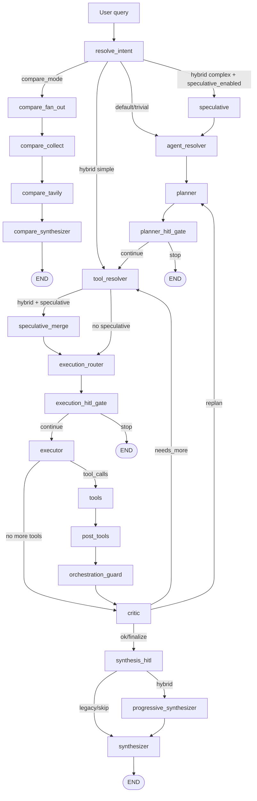

# OneSeek Platform

OneSeek ar en agentplattform for realtidsanalys, verktygsorkestrering och transparent AI-beslutslogik.
Projektet har historiskt hetat SurfSense, vilket fortfarande syns i vissa katalognamn (`surfsense_backend`, `surfsense_web`), men arkitekturen nedan beskriver den aktuella OneSeek-implementationen.

---

## Innehallsforteckning

1. [Plattformsoversikt](#plattformsoversikt)
2. [Karnfunktioner](#karnfunktioner)
3. [LangGraph-flode (Fas 1-4)](#langgraph-flode-fas-1-4)
4. [Intent + Bigtool + Namespace + Rerank](#intent--bigtool--namespace--rerank)
5. [Realtidsdata och API-integrationer](#realtidsdata-och-api-integrationer)
6. [Compare-lage](#compare-lage)
7. [LangSmith + full transparens (trace)](#langsmith--full-transparens-trace)
8. [Memory och feedback-loopar](#memory-och-feedback-loopar)
9. [Eval-systemet](#eval-systemet)
10. [SSE/Data Stream-events](#ssedata-stream-events)
11. [Kodstruktur (viktigaste filer)](#kodstruktur-viktigaste-filer)
12. [Konfiguration och feature flags](#konfiguration-och-feature-flags)
13. [Teststatus for Fas 1-4 + eval](#teststatus-for-fas-1-4--eval)

---

## Plattformsoversikt

OneSeek ar byggt for att:

- routa fragor till ratt agent och verktyg
- hamta data fran interna och externa kallor i realtid
- kombinera deterministisk kontroll med LLM-baserad syntes
- exponera hela kedjan (fraga -> route -> plan -> verktyg -> svar) via trace
- evaluera och iterera systematiskt med inbyggt eval-system

Tekniskt anvands:

- **FastAPI** (backend/API)
- **LangGraph** (agentgraf och tillstand)
- **Bigtool-retrieval** (dynamiskt verktygsval)
- **LiteLLM** (modellabstraktion)
- **PostgreSQL + Redis + Celery** (persistens och asynkjobb)
- **Vercel AI Data Stream-protokoll (SSE)** for realtidsstreaming i UI

---

## Karnfunktioner

- **Hybrid Supervisor v2 (Fas 1-4)**
  - graph complexity-klassning (`trivial`, `simple`, `complex`)
  - execution strategy-router (`inline`, `parallel`, `subagent`)
  - speculative branch + merge
  - progressive synthesizer med draft-streaming
- **Deterministiskt compare-lage**
  - parallella externa modellanrop
  - separat compare-subgraf
- **Realtids-APIer**
  - trafik, vader, statistik, riksdag, bolag, geodata, marknadsplatser m.m.
- **Transparens och observability**
  - in-app trace spans (input/output/meta/tokens/duration)
  - LangSmith-stod via env-konfiguration
- **Eval och auto-loop**
  - route/agent/tool/API-input-eval
  - metadata/prompt/tuning-forslag
  - stage-jamforelse over tid

---

## LangGraph-flode (Fas 1-4)

### Huvudflode (normal mode)



### Nodlogik som tillkommit i Fas 1-4

- **Fas 1**
  - `resolve_intent`: klassar `graph_complexity`
  - `smart_critic`: mekaniska regler + fallback till LLM-critic
  - `targeted_missing_info` till `tool_resolver`
- **Fas 2**
  - `execution_router`: val av `inline/parallel/subagent`
  - timeout-policy per strategi
- **Fas 3**
  - episodic memory (TTL + LRU, scope per `search_space_id` + `user_id`)
  - retrieval feedback-store som paverkar ranking
- **Fas 4**
  - `speculative` + `speculative_merge`
  - ateranvandning av speculative resultat i `call_agent` och `call_agents_parallel`
  - `progressive_synthesizer` + `data-synthesis-draft` i stream

---

## Intent + Bigtool + Namespace + Rerank

### Intent och agentval

1. Top-level route dispatch (`knowledge`, `action`, `statistics`, `smalltalk`, `compare`)
2. Intent resolver bygger `intent_id`, confidence, reason
3. Supervisor valjer agent(er) dynamiskt (`retrieve_agents`)

### Bigtool namespace-struktur

Verktyg indexeras i namespace-hierarki, t.ex.:

- `tools/knowledge/*`
- `tools/action/*`
- `tools/statistics/*`
- `tools/general/*`
- `tools/compare/*`
- doman-specifika som `tools/marketplace/*`, `tools/politik/*`

### Retrieval + scoring + rerank

Smart retrieval beraknar flera komponenter:

- namnmatch
- keyword-traf
- beskrivningstraf
- example-query-traf
- embedding-likhet
- namespace-boost
- retrieval-feedback-boost

Pre-score:

```text
pre_rerank_score =
  lexical_score
  + (embedding_score * embedding_weight)
  + namespace_bonus
  + retrieval_feedback_boost
```

Sedan rerankas kandidater med `RerankerService` och exponerar detaljer i breakdown/trace.

---

## Realtidsdata och API-integrationer

OneSeek har verktyg for live data och officiella kallor, bl.a.:

- **SMHI** (vader)
- **Trafiklab** (rutter/avgangar)
- **Trafikverket** (trafik, kameror, vagstatus m.m.)
- **SCB** (statistik)
- **Riksdagen** (dokument, voteringar, anforanden)
- **Bolagsverket** (bolagsdata)
- **Geoapify** (kartor/geokodning)
- **Marketplace** (Blocket/Tradera-relaterade floden)
- **Web/knowledge** (t.ex. Tavily, docs, intern kunskapsbas)

Tool-output kan ingestas till connector-lagret for citationer och historik.

---

## Compare-lage

Compare ar en deterministisk subgraf (inte "fri" LLM-tool-calling):

1. `compare_fan_out`: anropar **alla** externa compare-modeller parallellt
2. `compare_collect`: sammanstaller status/komplettering
3. `compare_tavily`: optional web-enrichment
4. `compare_synthesizer`: slutlig syntes

Vanliga compare-modeller (via externa toolspecs) inkluderar:

- Grok
- GPT
- Claude
- Gemini
- DeepSeek
- Perplexity
- Qwen

Designmal:

- inga oavsiktliga modellbortfall
- full verktygshistorik till frontend
- konsekvent citerings- och outputflode

---

## LangSmith + full transparens (trace)

### LangSmith (ibland kallat "Longsmith")

Projektet har LangSmith-observability via env:

```env
LANGSMITH_TRACING=true
LANGSMITH_ENDPOINT=https://api.smith.langchain.com
LANGSMITH_API_KEY=...
LANGSMITH_PROJECT=surfsense
```

### In-app trace (full kedja i plattformen)

Ut over extern observability har OneSeek en intern trace-pipeline:

- `ChatTraceSession` + `ChatTraceSpan` i DB
- spans for chain/model/tool med:
  - input (inklusive prompt payload for model-span)
  - output
  - meta
  - input/output/total tokens
  - duration/status/parent-child

SSE-events:

- `data-trace-session`
- `data-trace-span`

API-endpoints:

- `GET /threads/{thread_id}/messages/{message_id}/traces`
- `POST /threads/{thread_id}/trace-sessions/{trace_session_id}/attach`

Detta ger praktisk "fran fraga till svar"-transparens, inklusive verktygsinput/verktygsoutput och interna nodsteg.

---

## Memory och feedback-loopar

### Episodic memory (Fas 3)

- processminne med TTL + LRU
- keying/scoping per `search_space_id` + `user_id`
- anvands for att undvika onodiga omanrop av samma query/tool

### Retrieval feedback (Fas 3)

- success/failure-signal per query/tool
- score -> boost/penalty i retrievalrankingen
- stanger loopen mellan utfall och framtida verktygsval

### Speculative reuse (Fas 4)

- speculative path forbereder sannolika verktyg
- `speculative_merge` markerar vad som kan ateranvandas
- `call_agent` / `call_agents_parallel` hoppar over duplicerade anrop vid hit

---

## Eval-systemet

OneSeek har ett komplett evalsystem for supervised iteration.

### Stage-typer

- **Tool selection eval**
- **API input eval**
- **Auto-loop eval** (iterativ tuning)

### Viktiga endpoints

- `POST /tool-settings/evaluate`
- `POST /tool-settings/evaluate/start`
- `GET /tool-settings/evaluate/{job_id}`
- `POST /tool-settings/evaluate-api-input`
- `POST /tool-settings/evaluate-api-input/start`
- `GET /tool-settings/evaluate-api-input/{job_id}`
- `POST /tool-settings/evaluate-auto-loop/start`

### Metriker (inkl. Fas 1-4)

- `intent_accuracy`
- `route_accuracy`
- `sub_route_accuracy`
- `graph_complexity_accuracy`
- `execution_strategy_accuracy`
- `agent_accuracy`
- `plan_accuracy`
- `tool_accuracy`
- `retrieval_recall_at_k`
- `supervisor_review_score` / `supervisor_review_pass_rate`
- API-input-specifika: schema validity, required field recall, field value accuracy, clarification accuracy

### Eval-output och forslag

Evalsystemet kan generera:

- metadata-forslag for tools
- prompt-forslag (agent/supervisor/tool)
- retrieval tuning-forslag
- intent-definition-forslag
- stage-jamforelse med trend/guidance

---

## SSE/Data Stream-events

Frontend far live-events via Vercel AI data stream. Exempel:

- `text-delta`
- `data-thinking-step`
- `data-context-stats`
- `data-trace-session`
- `data-trace-span`
- `data-synthesis-draft` (Fas 4)

`data-synthesis-draft` skickas innan slutsyntesen nar progressive synthesizer ar aktiv.

---

## Kodstruktur (viktigaste filer)

- `surfsense_backend/app/agents/new_chat/supervisor_agent.py`
- `surfsense_backend/app/agents/new_chat/nodes/intent.py`
- `surfsense_backend/app/agents/new_chat/nodes/execution_router.py`
- `surfsense_backend/app/agents/new_chat/nodes/smart_critic.py`
- `surfsense_backend/app/agents/new_chat/nodes/speculative.py`
- `surfsense_backend/app/agents/new_chat/nodes/progressive_synthesizer.py`
- `surfsense_backend/app/agents/new_chat/episodic_memory.py`
- `surfsense_backend/app/agents/new_chat/retrieval_feedback.py`
- `surfsense_backend/app/agents/new_chat/bigtool_store.py`
- `surfsense_backend/app/tasks/chat/stream_new_chat.py`
- `surfsense_backend/app/services/tool_evaluation_service.py`
- `surfsense_backend/app/routes/admin_tool_settings_routes.py`
- `surfsense_backend/app/services/trace_service.py`

---

## Konfiguration och feature flags

Runtime-flaggor i chatflodet:

```json
{
  "runtime_hitl": {
    "enabled": true,
    "hybrid_mode": true,
    "speculative_enabled": true
  }
}
```

- `hybrid_mode=false`: legacy/kompatibilitetsflode
- `hybrid_mode=true`: aktiverar hybridnoder
- `speculative_enabled=true`: aktiverar speculative branch i komplexa queries

---

## Teststatus for Fas 1-4 + eval

Karnsviter for hybrid och eval:

- `tests/test_hybrid_phase1.py`
- `tests/test_execution_router_phase2.py`
- `tests/test_phase3_memory_feedback.py`
- `tests/test_phase4_speculative_progressive.py`
- `tests/test_tool_evaluation_service.py`

Exempelkommando:

```bash
cd surfsense_backend
python3 -m pytest -q \
  tests/test_tool_evaluation_service.py \
  tests/test_hybrid_phase1.py \
  tests/test_execution_router_phase2.py \
  tests/test_phase3_memory_feedback.py \
  tests/test_phase4_speculative_progressive.py
```

---

## Sammanfattning

OneSeek ar nu en hybrid, transparent och eval-driven agentplattform med:

- adaptiv LangGraph-orkestrering (Fas 1-4)
- dynamiskt agent- och verktygsval med Bigtool namespaces + rerank
- realtidsdata och compare-subgraf
- LangSmith + intern trace for full observability
- produktionsnara evalloop for kontinuerlig forbattring

