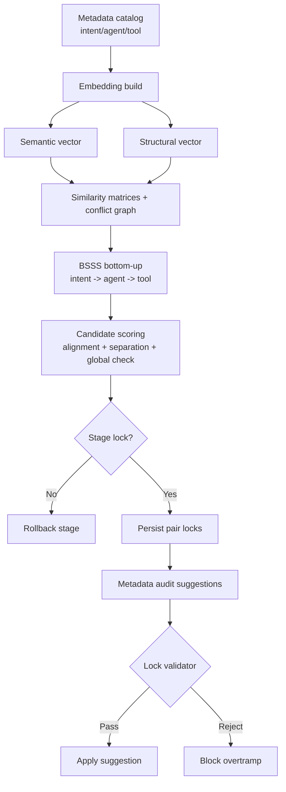
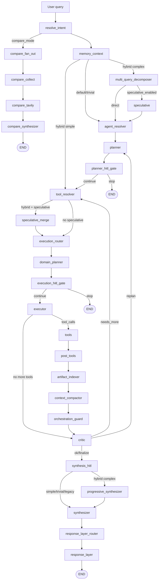
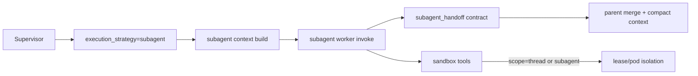

# OneSeek Platform

OneSeek ar en agentplattform for realtidsanalys, verktygsorkestrering och transparent AI-beslutslogik.
Projektet har historiskt hetat SurfSense, vilket fortfarande syns i vissa katalognamn (`surfsense_backend`, `surfsense_web`), men arkitekturen nedan beskriver den aktuella OneSeek-implementationen.

---

## Innehallsforteckning

1. [Plattformsoversikt](#plattformsoversikt)
2. [Karnfunktioner](#karnfunktioner)
3. [Senaste uppdateringar (denna PR)](#senaste-uppdateringar-denna-pr)
4. [LangGraph-flode (Fas 1-4 + subagent A-F)](#langgraph-flode-fas-1-4--subagent-a-f)
5. [Strict subagent isolation + DeerFlow-style context (A-F)](#strict-subagent-isolation--deerflow-style-context-a-f)
6. [Intent + Bigtool + Namespace + Rerank](#intent--bigtool--namespace--rerank)
7. [Centrala metadataganser och normaliserad scoring](#centrala-metadataganser-och-normaliserad-scoring)
8. [Identitetsmetadata (template-falt)](#identitetsmetadata-template-falt)
9. [DB-driven flodesgraf + admin-UI](#db-driven-flodesgraf--admin-ui)
10. [Realtidsdata och API-integrationer](#realtidsdata-och-api-integrationer)
11. [Compare-lage](#compare-lage)
12. [LangSmith + full transparens (trace)](#langsmith--full-transparens-trace)
13. [Memory och feedback-loopar](#memory-och-feedback-loopar)
14. [Eval-systemet](#eval-systemet)
15. [SSE/Data Stream-events](#ssedata-stream-events)
16. [Kodstruktur (viktigaste filer)](#kodstruktur-viktigaste-filer)
17. [Konfiguration och feature flags](#konfiguration-och-feature-flags)
18. [Sandbox step-by-step guide](#sandbox-step-by-step-guide)
19. [Copy-paste only quickstart (Docker + K8s)](#copy-paste-only-quickstart-docker--k8s)
20. [Teststatus for Fas 1-4 + eval](#teststatus-for-fas-1-4--eval)

---

## Plattformsoversikt

OneSeek ar byggt for att:

- routa fragor till ratt agent och verktyg
- hamta data fran interna och externa kallor i realtid
- kombinera deterministisk kontroll med LLM-baserad syntes
- exponera hela kedjan (fraga -> route -> plan -> verktyg -> svar) via trace
- evaluera och iterera systematiskt med inbyggt eval-system

Tekniskt anvands:

- **FastAPI** (backend/API)
- **LangGraph** (agentgraf och tillstand)
- **Bigtool-retrieval** (dynamiskt verktygsval)
- **LiteLLM** (modellabstraktion)
- **PostgreSQL + Redis + Celery** (persistens och asynkjobb)
- **Vercel AI Data Stream-protokoll (SSE)** for realtidsstreaming i UI

---

## Karnfunktioner

- **Hybrid Supervisor v2 (Fas 1-4)**
  - graph complexity-klassning (`trivial`, `simple`, `complex`)
  - execution strategy-router (`inline`, `parallel`, `subagent`)
  - speculative branch + merge
  - progressive synthesizer med draft-streaming
  - strict subagent isolation + DeerFlow-style context management (A-F)
- **Deterministiskt compare-lage**
  - parallella externa modellanrop
  - separat compare-subgraf
- **Realtids-APIer**
  - trafik, vader, statistik, riksdag, bolag, geodata, marknadsplatser m.m.
- **Transparens och observability**
  - in-app trace spans (input/output/meta/tokens/duration)
  - LangSmith-stod via env-konfiguration
- **Eval och auto-loop**
  - route/agent/tool/API-input-eval
  - metadata/prompt/tuning-forslag
  - stage-jamforelse over tid
- **Centrala metadataganser + normaliserad scoring**
  - harda faltgranser for alla metadata-falt (description, keywords, examples, excludes, identitet)
  - `enforce_metadata_limits()` som 3-lagers defense in depth (frontend, API, core)
  - normaliserad lexical scoring som eliminerar faltlangs-bias
- **Identitetsmetadata**
  - template-falt (main_identifier, core_activity, unique_scope, geographic_scope, excludes) for battre retrieval-separation
- **DB-driven flodesgraf + visuell admin**
  - databas-backade route/tool-mappningar i stallet for hardkodning
  - inline prompt-redigering, intent-redigering, drag-and-drop tool-grupper i admin-UI

---

## Senaste uppdateringar (denna PR)

Denna PR innehaller loop-fix (P1-P2), multi-query decomposer (P3), bigtool subagent loop guard, samt uppgradering av admin-ytan for metadata-kvalitet och kontrollerad live-rollout for routing.

### 0) Loop-fix + Multi-query decomposer (P1-P3)

**Loop-fix (P1-P2):**
- `guard_finalized` forhindrar critic fran att overrida orchestration_guard
- `total_steps` hard cap (MAX_TOTAL_STEPS=12) tvangar synthesis vid overtid
- `critic_history` med adaptiv loop-breaking (2x `needs_more` → force `ok`)
- `NormalizingChatWrapper` med bigtool loop guard — stoppar subagenter som anropar samma verktyg >2 ggr
- Executor `executor_should_continue` loop guard for direkt-tool-anrop
- `response_layer_router` + `response_layer` som enda synliga text-output
- `THINK_ON_TOOL_CALLS` toggle for att stanga av `<think>`-block i executor

**Multi-query decomposer (P3):**
- Ny nod `multi_query_decomposer` for komplexa fragor
- Bryter ned sammansatta fragor till atomara delfragor med beroendegraf
- `atomic_questions` state-falt: `[{id, text, depends_on, domain}]`
- Planner konsumerar `atomic_questions` och valjer multi-domain-template automatiskt
- Skippar dekomponering for simple/trivial fragor (noll extra latens)
- Pydantic-scheman: `AtomicQuestion`, `DecomposerResult`
- 11 tester i `tests/test_multi_query_decomposer.py`, alla passerar

### 1) Metadata Catalog + Metadata Audit (admin)

- Ny adminflik for metadata pa **intent/agent/tool** med edit/save och tydlig visning av effektiv metadata.
- Metadata Audit kor i lager:
  - `query -> intent retrieval -> agent retrieval -> tool retrieval`
  - per lager loggas bl.a. `top1`, `top2`, `margin`, `score_breakdown`, `expected/predicted`.
- Collision-analys med matriser for intent/agent/tool samt gemensam path-matris.
- Konditionerade metriker:
  - `agent precision givet korrekt intent`
  - `tool precision givet korrekt intent+agent`
- Vector recall-lager (top-K) och tool-aware embedding-context exponerade i audit-resultatet.
- Steg A/B parallelism ar konfigurerbar i UI:
  - probe generation parallelism
  - suggestion parallelism
- Granulara tidsdiagnoser:
  - Steg 1 (prep/qgen/eval + per-layer I/A/T)
  - Steg 2 (prep + tool/intent/agent stage)
- Probe/exempelfrage-guardrails:
  - naturlig svenska med korrekt diakritik
  - strikt forbud mot tool_id/toolnamn/internala identifierare i genererade fragor
- Autonomous audit-loop med stoppvillkor:
  - max rounds, patience, abort-drop, target score
  - valbar probe-history exclusion mellan rundor
  - anchor probe-set mode for stabil jamforelse mellan rundor
- Live-tabeller i UI:
  - evolution (aldre vs nyare audit med delta/kommentar)
  - ranking stability per tool mellan rundor

### 2) Kontrastiva tool-descriptions + namespace-aware exposure

Ny optimering av retrieval-systemet for att losa embedding-kollisioner mellan tools som delar domanvokabular (t.ex. 22 Trafikverket-tools som alla handlar om "trafik").

#### Kontrastiva descriptions

Tools inom samma namespace-kluster far nu en `Excludes:`-sektion i sin embedding-text som pushar isar vektorer:

```text
trafikverket_trafikinfo_koer
Koer, trafikstockning och trangsel pa vagar i realtid.
Keywords: ko, trafikstockning, trangsel, framkomlighet
Examples: Ar det ko pa E4? | Hur ser trafiklaget ut i Goteborg?
Excludes: olycka, krock, storning, hinder, vagarbete, omledning, hastighet, prognos
```

- `TOOL_CONTRASTIVE_EXCLUSIONS` i `bigtool_store.py`: map med exkluderingstermer per namespace-kluster
- `build_contrastive_description()`: bygger kontrastiv text for embedding + reranker
- Tacker alla Trafikverket-kluster: trafikinfo, tag, vag, vader, kameror, prognos
- Anvands av bade semantic embedding och reranker (cross-encoder)

#### Namespace-aware tool exposure

Istallet for att retrieval filtrerar till top-5 tools, exponeras nu alla tools i agentens namespace direkt till LLM:en med retrieval-scores som guidance:

- `AGENT_NAMESPACE_MAP`: definierar vilka agenter som har begransade namespaces (trafik, weather, statistics, etc.)
- `get_namespace_tool_ids()`: returnerar alla tool-IDs i en agents namespace
- `get_namespace_tool_ids_with_retrieval_hints()`: returnerar alla tools + retrieval-score-breakdown som hints
- Troskel: max 30 tools per namespace, over det faller systemet tillbaka till retrieval-filtrering
- `tool_resolver` far ny `namespace_tool_ids_fn` callback och anvander `namespace_full` mode

**Princip**: Retrieval-systemet bestammer *ranking* (vilka tools systemet tror ar bast), men LLM:en far se *alla* och gora slutvalet.

#### Eval-forbattringar

- `build_namespace_confusion_matrix()`: per-namespace confusion matrix (expected vs predicted) i eval-output
- `generate_contrastive_probes()`: auto-genererar hard-negative testfall fran tools' example_queries
- Ny metrik `namespace_confusion` i eval metrics-output

#### Competitor tracking i retrieval feedback

- `FeedbackSignal.competitor_wins`: sparar vilken competitor-tool som vann vid failures
- `record(competitor_tool_id=...)`: ny parameter for att logga vilken tool som valdes istallet
- `snapshot()` inkluderar `top_competitors` per signal for debugging

**Filer:**
- `bigtool_store.py`: `TOOL_CONTRASTIVE_EXCLUSIONS`, `build_contrastive_description()`, `AGENT_NAMESPACE_MAP`, `get_namespace_tool_ids()`, `get_namespace_tool_ids_with_retrieval_hints()`
- `nodes/tool_resolver.py`: `namespace_tool_ids_fn`, `namespace_full` mode
- `tool_evaluation_service.py`: `build_namespace_confusion_matrix()`, `generate_contrastive_probes()`
- `retrieval_feedback.py`: `competitor_wins`, `record_competitor()`, `top_competitors`

### 3a) Ranking stability + dual embeddings

- Tool retrieval har nu separata embeddings:
  - **semantic vector** (description/examples)
  - **structural vector** (schema/required fields/input shape/output hint)
- Vikterna ar separata och justerbara (`semantic_embedding_weight`, `structural_embedding_weight`).
- Ranking stability-metriker i audit:
  - rank shift mellan rundor
  - margin mot narmaste konkurrent
  - top1/topK-frekvens
  - expected rank och expected margin per tool

### 3b) Live rollout med faser och admin-toggle

Implementerad fasstyrd utrullning i produktion med central styrning via Retrieval Tuning:

- **Fas 0 - shadow**: ingen beteendeforandring, endast loggning av top1/top2/margin.
- **Fas 1 - tool_gate**: verktygsval med gate (auto top1 vid stark margin/score, annars top-K fallback).
- **Fas 1b - agent_auto**: konservativ agent auto-select baserat pa margin + score.
- **Fas 2 - adaptive**: adaptiva per-tool thresholds baserat pa utfallsfeedback.
- **Fas 3 - intent_finetune**: intent shortlist + vikter (lexical/semantic) i intent resolver.

Nya loggar ar tillagda for intent/agent/tool-selection och tool-outcome for att mojliggora skuggkorning och kontrollerad ramp-up.

### 4) Praktisk korguide: Metadata Audit + BSSS + verifiering

Folj detta for att fa jamforbara resultat och undvika att tolka "falska hopp" mellan rundor:

1. **Baseline (single metadata audit)**
   - Kor `Metadata Audit` en gang.
   - Spara:
     - intent/agent/tool-accuracy
     - conditional metrics (`agent|intent`, `tool|intent+agent`)
     - ranking stability-tabellen
     - diagnostics (Steg1/Steg2 ms + probe-volym)

2. **Separation (Bottom-up BSSS)**
   - Kor `Bottom-up Separation` pa samma urval (tool_ids/prefix).
   - Kontrollera i svaret:
     - stage lock-status per lager
     - baseline vs final summary
     - diagnostics + antal skapade separation-locks

3. **Autonomous metadata-loop (forbattringsfas)**
   - Kor autonom loop (t.ex. 4-8 rundor) med tydliga stoppvillkor.
   - For stabil trendtolkning:
     - anvand **anchor probe-set mode** om du vill mata "samma frageset" mellan rundor
     - anvand samma eval-konfiguration (max_tools, max_queries, hard negatives, prefix/tool_ids)

4. **Verifiering efter loop**
   - Kor en ny single audit.
   - Jamfor:
     - **Runda-mot-runda** (stabilitet over samma probes)
     - **Single-run mot baseline** (generalisering pa nytt query-urval)

#### Varfor kan single-run bli samre efter en stark auto-loop?

Det ar normalt om single-run bygger ett **annat frageset** an auto-loopens interna jamforelse:

- Auto-loop kan ge hog score pa ett stabilt/ankrat probe-set.
- En ny single-run utan anchor/probe-likhet provar andra fragor (hard negatives, andra formuleringar).
- Resultatet blir da en mer "out-of-sample" kontroll och kan falla tillbaka.

Det betyder inte nodvandigtvis att forbattringen ar falsk - utan att robustheten inte ar jamn over hela query-rummet an.

#### Rekommenderade guardrails

- Hall eval-konfigurationen konstant nar du jamfor.
- Tracka bade:
  - **stabilitetsmetrik** (rank shift, churn, margin)
  - **generalisering** (ny single-run utan anchor)
- Vid stor skillnad: kor en extra BSSS-runda pa kvarvarande kollisionskluster och verifiera igen.
- BSSS lock mode ar aktivt for att hindra att vanliga metadata-forslag aterintroducerar tidigare separation-kollisioner.

#### Visuell rymdmodell: embedding -> separation -> lock -> overtrampsblock



#### Embedding-space matrix (hur varje lager styrs och lases)

| Lager | Primar alignment-signal | Primar separation-signal | Global safety | Locknyckel |
|---|---|---|---|---|
| Intent | likhet mot egna intent-fragor/metadata | avstand till narmaste andra intent | nearest-neighbor + cluster-balance | `(intent, item_a, item_b)` |
| Agent | likhet givet korrekt intent | avstand till narmaste andra agent inom intent-rymden | upstream-check mot intent + global nn-check | `(agent, item_a, item_b)` |
| Tool | likhet givet korrekt intent+agent | avstand till narmaste andra tool i kategori/cluster | local + global margin + cluster-balance | `(tool, item_a, item_b)` |

#### Scoring-matris (bottom-up aggressivitet)

| Lager | Score-formel |
|---|---|
| Intent | `0.7 * alignment + 0.3 * (1 - nearest_intent_similarity)` |
| Agent | `0.6 * alignment + 0.4 * (1 - nearest_agent_similarity)` |
| Tool | `0.5 * alignment + 0.5 * (1 - nearest_tool_similarity)` |

#### Tool-lager: dual embedding-fusion (semantik + struktur)

| Komponent | Innehall | Vikt |
|---|---|---|
| Semantic vector | description + keywords + example_queries | `semantic_embedding_weight` |
| Structural vector | schema/required fields/input shape/output hints | `structural_embedding_weight` |
| Fusion | viktad cosine-fusion | normaliserad summa av vikter |

#### Overtramps-firewall (var overtramp stoppas)

| Steg | Vad kommer in | Kontroll | Resultat vid fail |
|---|---|---|---|
| BSSS stage-gate | kandidatmetadata | local/global similarity + alignment drop + cluster-balance | stage rollback |
| Suggestion-filter | Steg B-forslag | pair-lock validering i embedding-rummet | forslaget filtreras bort |
| Metadata apply | PUT metadata-catalog | lock-validering innan persist | `409` block med rejected-lista |

#### Vad du ska kontrollera i UI efter varje korning

1. **Efter BSSS**
   - stage reports: `locked=true` per lager
   - similarity matrices: se att kritiska par/kluster separeras
   - diagnostics: `separation_lock_new_pairs`, `separation_lock_total_pairs`
2. **Efter metadata suggestions**
   - diagnostics: `separation_lock_rejected_tool/intent/agent`
   - forslagslistan: att blockerade overtramp inte dyker upp som applybara
3. **Efter metadata apply**
   - inga `409` lock-brott vid legitima uppdateringar
   - om `409`: svaret innehaller `code=BSSS_LOCK_VIOLATION`, `message`, `conflicts[]` (lager + item/konkurrent + similarity/grans) och `rejected`
   - anvand `conflicts[]` for att se exakt vilket lock som blockerat uppdateringen
   - admin-UI visar en tabell **"Blockerade av lock"** med samma konfliktpar for snabb felsokning
   - varje rad har knappen **"Applicera saker rename"** som provar minimal namnandring mot lock-validering innan den appliceras i draft
   - vid behov finns en manuell override-toggle som kan ignorera locken vid save (rekommendation: kor BSSS igen direkt efterat)

### 5) Centrala metadataganser + normaliserad scoring

Alla metadata-falt har nu harda granser definierade som centrala konstanter i `bigtool_store.py`. Samma granser anvands i backend-validering, LLM-prompter, separation-engine och frontend.

#### Centrala konstanter

| Konstant | Varde | Beskrivning |
|---|---|---|
| `METADATA_MAX_DESCRIPTION_CHARS` | 300 | Max tecken for tool-description |
| `METADATA_MAX_KEYWORDS` | 20 | Max antal keywords |
| `METADATA_MAX_EXAMPLE_QUERIES` | 10 | Max antal example queries |
| `METADATA_MAX_EXCLUDES` | 15 | Max antal exclude-termer |
| `METADATA_MAX_KEYWORD_CHARS` | 40 | Max tecken per keyword |
| `METADATA_MAX_EXAMPLE_QUERY_CHARS` | 120 | Max tecken per example query |
| `METADATA_MAX_MAIN_IDENTIFIER_CHARS` | 80 | Max tecken for main_identifier |
| `METADATA_MAX_CORE_ACTIVITY_CHARS` | 120 | Max tecken for core_activity |
| `METADATA_MAX_UNIQUE_SCOPE_CHARS` | 120 | Max tecken for unique_scope |
| `METADATA_MAX_GEOGRAPHIC_SCOPE_CHARS` | 80 | Max tecken for geographic_scope |
| `METADATA_MAX_EMBEDDING_TEXT_CHARS` | 800 | Max text for embedding-generering |

#### `enforce_metadata_limits()`

Central enforcement-funktion som clampar alla falt:

- Description trunkeras vid meningsgrans (`.`) om >60% av limiten bevaras
- Keywords dedupas och trunkeras per-item
- Example queries dedupas och trunkeras per-item
- Excludes trunkeras till max-antal
- Identitetsfalt (se nedan) trunkeras till sina respektive granser

Funktionen anropas pa tre nivaer (defense in depth):

1. **Frontend** - Zod-schema i `admin-tool-settings.types.ts` validerar fore POST
2. **Backend API** - Pydantic `field_validator` pa `ToolMetadataUpdateItem` auto-trunkerar
3. **Core** - `enforce_metadata_limits()` anropas i `_merge_candidates()`, audit-suggestions och eval-forslag

#### Normaliserad lexical scoring

Lexical scoring i `_score_entry_components()` normaliseras nu per faltlangd:

```python
keyword_hits = keyword_hits_raw / max(1, len(entry.keywords))
description_hits = description_hits_raw / max(1, len(description_tokens))
example_hits = example_hits_raw / max(1, len(entry.example_queries))
```

Detta forhindrar att tools med fler keywords/langre descriptions far orattvist hoga scorer. Ett tool med 5/20 keyword-traffar scorer inte hogre an ett tool med 2/5 traffar.

#### LLM-prompter med explicita granser

Alla LLM-prompter for metadata-forslag (eval, audit, BSSS) inkluderar nu de numeriska granserna explicit sa att modellen inte genererar overstor metadata:

```text
- description: max 300 tecken
- keywords: max 20 stycken, max 40 tecken/keyword
- example_queries: max 10 stycken, max 120 tecken/fraga
- excludes: max 15 stycken
```

**Filer:**
- `bigtool_store.py`: konstanter + `enforce_metadata_limits()` + normaliserad scoring
- `admin_tool_settings.py` (schemas): Pydantic field_validators
- `admin-tool-settings.types.ts`: Zod-scheman (frontend)
- `metadata_separation_service.py`: `enforce_metadata_limits()` i `_merge_candidates()`
- `tool_evaluation_service.py`: explicita granser i LLM-prompter
- `metadata_audit_service.py`: `enforce_metadata_limits()` efter forslag

### 6) Identitetsmetadata (template-falt)

Varje tool har nu separata identitetsfalt utover description/keywords/examples:

| Falt | Syfte | Exempel |
|---|---|---|
| `main_identifier` | Huvudidentifierare - vad toolet heter/ar | "Trafikverkets korapport" |
| `core_activity` | Karnaktivitet - vad toolet gor | "Hamtar realtidsdata om koer och trangsel pa svenska vagar" |
| `unique_scope` | Unik avgransning - vad som skiljer detta tool fran liknande | "Enbart koer och trangsel, inte olyckor eller vagarbeten" |
| `geographic_scope` | Geografisk avgransning | "Sverige, rikstackande" |
| `excludes` | Exkluderar - vad toolet INTE hanterar | ["olycka", "krock", "vagarbete"] |

Identitetsfalt propageras genom hela pipeline:

- **Eval**: inkluderas i metadata-forslag och scoring
- **Audit**: visas i metadata-tabeller och forslagsgenerering
- **BSSS**: anvands for separation-kandidater
- **Vector/embedding**: bidrar till embedding-text for battre retrieval
- **Admin UI**: redigerbara i metadata-katalogen och flow-vyn

Falten lagras i JSONB (ingen databasmigration behovs).

### 7) DB-driven flodesgraf + admin-UI

Admin-ytan har nu en fullstandig visuell flodesgraf som speglar LangGraph-pipelinen med redigeringskapacitet direkt i UI.

#### DB-backed mappningar

Hardkodade agent-policyer ar ersatta med databas-backade metadata:

- `routes: list[str]` - vilka intents/routes en agent betjanar
- `flow_tools: list[{tool_id, label}]` - vilka tools som tillhor en agent

#### Nya API-endpoints

| Metod | Endpoint | Beskrivning |
|---|---|---|
| `PATCH` | `/flow-graph/agent-routes` | Uppdatera vilka routes en agent betjanar |
| `PATCH` | `/flow-graph/agent-tools` | Uppdatera vilka tools som tillhor en agent |
| `PUT` | `/flow-graph/intent` | Skapa/uppdatera intent-definition |
| `DELETE` | `/flow-graph/intent` | Ta bort intent-definition |

#### Pipeline-visualisering (full-width)

- Alla 21 execution-noder visas med stage-gruppering och fargkodning
- Full-width layout (utanfor max-w-7xl container)
- Noder grupperade efter fas: Routing, Planning, Execution, Synthesis

#### Inline-redigering i sidopaneler

- **Pipeline-sidopanel**: inline prompt-redigering med versionshistorik (save/reset)
- **Routing-sidopanel**: inline intent-redigering (label, description, keywords, priority, enabled)
- **Agent-detalj**: redigerbara route-checkboxar
- Intent-definitioner anvander template-placeholders (HUVUDIDENTIFIERARE, KARNAKTIVITET, etc.)
- Ta bort intent med bekraftelsedialog

#### Kollapsbara tool-grupper med drag-and-drop

- Tool-grupper ar kollapsade per default i routing-vyn; klicka for att expandera
- Drag-and-drop tools mellan agentgrupper med automatisk namespace-andring
- Klicka pa tool for att oppna redigeringssidopanel (namn, description med template, keywords, example queries, kategori, agent-tillhorighet)
- ToolGroupNode visar expand/collapse-chevron med antal-badge
- Agent-till-tool-kanter renderas enbart nar malgruppen ar expanderad

**Filer (backend):**
- `admin_flow_graph_routes.py`: nya PATCH/PUT/DELETE-endpoints
- `admin_flow_graph_service.py` (om relevant): DB-logik for mappningar

**Filer (frontend):**
- `flow-detail-panel.tsx`: inline-redigering, kollapsbara grupper
- `flow-graph-page.tsx`: full-width layout, data-refresh callbacks
- `tool-group-node.tsx`: collapse/expand, DnD
- `admin-flow-graph-api.service.ts`: API-anrop for route/tool-redigering

---

## LangGraph-flode (Fas 1-4 + subagent A-F)

### Huvudflode (normal mode)



### Nodlogik som tillkommit i Fas 1-4 + A-F

- **Fas 1**
  - `resolve_intent`: klassar `graph_complexity`
  - `smart_critic`: mekaniska regler + fallback till LLM-critic
  - `targeted_missing_info` till `tool_resolver`
- **Fas 2**
  - `execution_router`: val av `inline/parallel/subagent`
  - timeout-policy per strategi
- **Fas 3**
  - episodic memory (TTL + LRU, scope per `search_space_id` + `user_id`)
  - retrieval feedback-store som paverkar ranking
- **Fas 4**
  - `speculative` + `speculative_merge`
  - ateranvandning av speculative resultat i `call_agent` och `call_agents_parallel`
  - `progressive_synthesizer` + `data-synthesis-draft` i stream
- **Fas D**
  - `artifact_indexer`: offload av stora payloads till artifacts
  - `artifact_manifest` injiceras i prompt som kompakta refs
- **Fas E**
  - `context_compactor`: bygger `rolling_context_summary` nar contextbudget blir hog
  - pruning anvander semantisk sammanfattning i stallet for generisk marker
- **Fas F**
  - `memory_context`: selektiv cross-session memory-injektion fran `user_memories`
  - tydlig separering mellan aktiv session-kontekst och persistent minneskontekst
- **Loop-fix (P1-P2)**
  - `guard_finalized` + `total_steps` + `critic_history` for adaptiv loop-breaking
  - `NormalizingChatWrapper` med bigtool loop guard (max 2 identiska tool-anrop)
  - `response_layer_router` + `response_layer` som enda synliga text-output
  - `THINK_ON_TOOL_CALLS` toggle for att eliminera onodiga `<think>`-block
- **Multi-query decomposer (P3)**
  - `multi_query_decomposer`: bryter ned komplexa fragor till atomara delfragor
  - `atomic_questions` med beroendegraf (`depends_on`) for parallellisering
  - Planner konsumerar `atomic_questions` och valjer multi-domain-template automatiskt
  - Skippar dekomponering for simple/trivial fragor (noll extra latens)

---

## Strict subagent isolation + DeerFlow-style context (A-F)

OneSeek har nu ett strict isolation-spor som kan slas pa med runtime-flaggor.

### Fas A - context isolation + handoff contracts

- subagent-korningar far eget `subagent_id`
- subagent worker invoke far egen checkpoint namespace
- parent far kompakta handoff-kontrakt (`summary/findings/artifact_refs`)

### Fas B - sandbox scope isolation

- sandbox leases kan scopeas per `thread` eller per `subagent`
- strict mode injicerar `sandbox_scope=subagent` + `sandbox_scope_id=<subagent_id>`
- olika subagents i samma thread kan fa separata leases/pods

### Fas C - context management + observability

- parent prompt fylls med kompakta `subagent_handoffs` i stallet for full historik
- subagent parallelism kan begransas med `subagent_max_concurrency`
- route/runtime metadata exponerar subagent-flaggor i trace



### DeerFlow-style context management (D/E/F)

OneSeek innehaller nu en context-pipeline inspirerad av DeerFlow:

- **Fas D - Artifact-first offload**
  - stora tool-payloads offloadas automatiskt till artifact-filer
  - supervisor sparar endast kompakt metadata i `artifact_manifest`
  - prompten far `<artifact_manifest>` med refs i stallet for full raw payload

- **Fas E - Semantic compaction**
  - `context_compactor` bygger `rolling_context_summary` nar context blir stor
  - gamla steg komprimeras till semantisk sammanfattning
  - message-pruning anvander sammanfattningen i stallet for en generisk markor

- **Fas F - Session vs cross-session memory**
  - cross-session minne hamtas selektivt fran `user_memories`
  - endast relevanta minnesposter injiceras via `<cross_session_memory>`
  - aktiv session-kontekst (plan, handoffs, artifacts) hanteras separat

Nya runtime-flaggor:

- `artifact_offload_enabled` (bool)
- `artifact_offload_threshold_chars` (int)
- `artifact_offload_max_entries` (int)
- `context_compaction_enabled` (bool)
- `context_compaction_trigger_ratio` (float 0-1)
- `context_compaction_summary_max_chars` (int)
- `cross_session_memory_enabled` (bool)
- `cross_session_memory_max_items` (int)
- `cross_session_memory_max_chars` (int)

---

## Intent + Bigtool + Namespace + Rerank

### Intent och agentval

1. Top-level route dispatch (`knowledge`, `action`, `statistics`, `smalltalk`, `compare`)
2. Intent resolver bygger `intent_id`, confidence, reason
3. Supervisor valjer agent(er) dynamiskt (`retrieve_agents`)

### Bigtool namespace-struktur

Verktyg indexeras i namespace-hierarki, t.ex.:

- `tools/knowledge/*`
- `tools/action/*`
- `tools/statistics/*`
- `tools/general/*`
- `tools/compare/*`
- doman-specifika som `tools/marketplace/*`, `tools/politik/*`

### Retrieval + scoring + rerank

Smart retrieval beraknar flera komponenter:

- namnmatch
- keyword-traf
- beskrivningstraf
- example-query-traf
- embedding-likhet (semantic + structural, med kontrastiva descriptions)
- namespace-boost
- retrieval-feedback-boost (med competitor tracking)
- vector recall top-K (separat recall-lager fore hybrid/rerank)

Pre-score:

```text
pre_rerank_score =
  lexical_score
  + (semantic_score * semantic_embedding_weight)
  + (structural_score * structural_embedding_weight)
  + namespace_bonus
  + retrieval_feedback_boost
```

Sedan rerankas kandidater med `RerankerService` (anvander kontrastiv text med `Excludes:`-sektion nar tillganglig) och exponerar detaljer i breakdown/trace.

#### Namespace-aware tool exposure

For begransade agenter (trafik, weather, etc.) exponeras alla tools i agentens namespace till LLM:en med retrieval-scores som guidance-hints:

```text
agent=trafik
  -> alla 22 trafikverket-tools synliga for LLM
  -> retrieval-systemet bifogar ranking som hints (top1/top2/confidence)
  -> LLM:en gor slutvalet med full kontext
```

Troskel: max 30 tools per namespace for full exposure, annars retrieval-filtrering.

I live-rollouten kan samma signaler anvandas for fasstyrd gating:

- shadow: endast logga kandidater/margins
- tool_gate: auto top1 eller top-K fallback
- agent_auto: auto-select endast nar threshold passeras
- adaptive: per-tool threshold justeras over tid
- intent_finetune: intent shortlist + viktning aktiveras

---

## Centrala metadataganser och normaliserad scoring

Alla metadata-falt har centrala harda granser som tillämpas konsekvent genom hela systemet.

### Konstanter (definierade i `bigtool_store.py`)

| Konstant | Varde |
|---|---|
| `METADATA_MAX_DESCRIPTION_CHARS` | 300 |
| `METADATA_MAX_KEYWORDS` | 20 |
| `METADATA_MAX_EXAMPLE_QUERIES` | 10 |
| `METADATA_MAX_EXCLUDES` | 15 |
| `METADATA_MAX_KEYWORD_CHARS` | 40 |
| `METADATA_MAX_EXAMPLE_QUERY_CHARS` | 120 |
| `METADATA_MAX_EMBEDDING_TEXT_CHARS` | 800 |

Identitetsfalt har egna granser: `METADATA_MAX_MAIN_IDENTIFIER_CHARS` (80), `METADATA_MAX_CORE_ACTIVITY_CHARS` (120), `METADATA_MAX_UNIQUE_SCOPE_CHARS` (120), `METADATA_MAX_GEOGRAPHIC_SCOPE_CHARS` (80).

### Enforcement (defense in depth)

```text
Frontend (Zod)  ->  Backend API (Pydantic field_validator)  ->  Core (enforce_metadata_limits())
```

- **Frontend**: Zod-scheman i `admin-tool-settings.types.ts` validerar fore submit
- **Backend**: `ToolMetadataUpdateItem` Pydantic-modell auto-trunkerar via `field_validator`
- **Core**: `enforce_metadata_limits()` anropas i separation merge, audit-suggestions och eval-forslag

### Normaliserad lexical scoring

Lexical hit-counts divideras med faltlangd sa att tools med fler keywords inte far orattvis boost:

```python
keyword_hits = raw_hits / max(1, len(entry.keywords))
```

### LLM-prompter

Alla prompter for metadata-forslag inkluderar nu explicita numeriska granser sa att LLM:en inte genererar overstor metadata.

---

## Identitetsmetadata (template-falt)

Varje tool har separata identitetsfalt som kompletterar description/keywords/examples:

| Falt | Syfte |
|---|---|
| `main_identifier` | Huvudidentifierare - vad toolet ar |
| `core_activity` | Karnaktivitet - vad toolet gor |
| `unique_scope` | Unik avgransning - vad som skiljer det fran liknande tools |
| `geographic_scope` | Geografisk avgransning |
| `excludes` | Vad toolet INTE hanterar |

Identitetsfalt propageras genom:

- **Retrieval/embedding**: bidrar till embedding-text
- **Eval/audit**: inkluderas i forslag och scoring
- **BSSS**: anvands for separation-kandidater
- **Admin UI**: redigerbara i metadata-katalogen och flow-vyn

Falten lagras i JSONB (ingen databasmigration behovs).

---

## DB-driven flodesgraf + admin-UI

### DB-backed mappningar

Hardkodade agent-policyer ar ersatta med databas-backade metadata:

- `routes: list[str]` - vilka intents/routes en agent betjanar
- `flow_tools: list[{tool_id, label}]` - vilka tools som tillhor en agent

### API-endpoints

| Metod | Endpoint | Beskrivning |
|---|---|---|
| `PATCH` | `/flow-graph/agent-routes` | Uppdatera routes for agent |
| `PATCH` | `/flow-graph/agent-tools` | Uppdatera tools for agent |
| `PUT` | `/flow-graph/intent` | Skapa/uppdatera intent |
| `DELETE` | `/flow-graph/intent` | Ta bort intent |

### Visuell pipeline

- 21 execution-noder med stage-gruppering och fargkodning
- Full-width layout
- Inline prompt-redigering med versionshistorik
- Inline intent-redigering (label, description, keywords, priority, enabled)
- Kollapsbara tool-grupper med drag-and-drop mellan agenter

---

## Realtidsdata och API-integrationer

OneSeek har verktyg for live data och officiella kallor, bl.a.:

- **SMHI** (vader)
- **Trafiklab** (rutter/avgangar)
- **Trafikverket** (trafik, kameror, vagstatus m.m.)
- **SCB** (statistik)
- **Riksdagen** (dokument, voteringar, anforanden)
- **Bolagsverket** (bolagsdata)
- **Geoapify** (kartor/geokodning)
- **Marketplace** (Blocket/Tradera-relaterade floden)
- **Web/knowledge** (t.ex. Tavily, docs, intern kunskapsbas)

Tool-output kan ingestas till connector-lagret for citationer och historik.

---

## Compare-lage

Compare ar en deterministisk subgraf (inte "fri" LLM-tool-calling):

1. `compare_fan_out`: anropar **alla** externa compare-modeller parallellt
2. `compare_collect`: sammanstaller status/komplettering
3. `compare_tavily`: optional web-enrichment
4. `compare_synthesizer`: slutlig syntes

Vanliga compare-modeller (via externa toolspecs) inkluderar:

- Grok
- GPT
- Claude
- Gemini
- DeepSeek
- Perplexity
- Qwen

Designmal:

- inga oavsiktliga modellbortfall
- full verktygshistorik till frontend
- konsekvent citerings- och outputflode

---

## LangSmith + full transparens (trace)

### LangSmith (ibland kallat "Longsmith")

Projektet har LangSmith-observability via env:

```env
LANGSMITH_TRACING=true
LANGSMITH_ENDPOINT=https://api.smith.langchain.com
LANGSMITH_API_KEY=...
LANGSMITH_PROJECT=surfsense
```

### In-app trace (full kedja i plattformen)

Ut over extern observability har OneSeek en intern trace-pipeline:

- `ChatTraceSession` + `ChatTraceSpan` i DB
- spans for chain/model/tool med:
  - input (inklusive prompt payload for model-span)
  - output
  - meta
  - input/output/total tokens
  - duration/status/parent-child

SSE-events:

- `data-trace-session`
- `data-trace-span`

API-endpoints:

- `GET /threads/{thread_id}/messages/{message_id}/traces`
- `POST /threads/{thread_id}/trace-sessions/{trace_session_id}/attach`

Detta ger praktisk "fran fraga till svar"-transparens, inklusive verktygsinput/verktygsoutput och interna nodsteg.

---

## Memory och feedback-loopar

### Episodic memory (Fas 3)

- processminne med TTL + LRU
- keying/scoping per `search_space_id` + `user_id`
- anvands for att undvika onodiga omanrop av samma query/tool

### Retrieval feedback (Fas 3)

- success/failure-signal per query/tool
- score -> boost/penalty i retrievalrankingen
- stanger loopen mellan utfall och framtida verktygsval
- competitor tracking: sparar vilken tool som vann vid failures for att identifiera systematiska kollisioner

### Speculative reuse (Fas 4)

- speculative path forbereder sannolika verktyg
- `speculative_merge` markerar vad som kan ateranvandas
- `call_agent` / `call_agents_parallel` hoppar over duplicerade anrop vid hit

---

## Eval-systemet

OneSeek har ett komplett evalsystem for supervised iteration.

### Stage-typer

- **Tool selection eval**
- **API input eval**
- **Auto-loop eval** (iterativ tuning)

### Viktiga endpoints

- `POST /tool-settings/evaluate`
- `POST /tool-settings/evaluate/start`
- `GET /tool-settings/evaluate/{job_id}`
- `POST /tool-settings/evaluate-api-input`
- `POST /tool-settings/evaluate-api-input/start`
- `GET /tool-settings/evaluate-api-input/{job_id}`
- `POST /tool-settings/evaluate-auto-loop/start`

### Metriker (inkl. Fas 1-4)

- `intent_accuracy`
- `route_accuracy`
- `sub_route_accuracy`
- `graph_complexity_accuracy`
- `execution_strategy_accuracy`
- `agent_accuracy`
- `plan_accuracy`
- `tool_accuracy`
- `retrieval_recall_at_k`
- `supervisor_review_score` / `supervisor_review_pass_rate`
- API-input-specifika: schema validity, required field recall, field value accuracy, clarification accuracy

### Eval-output och forslag

Evalsystemet kan generera:

- metadata-forslag for tools
- prompt-forslag (agent/supervisor/tool)
- retrieval tuning-forslag
- intent-definition-forslag
- stage-jamforelse med trend/guidance
- **namespace confusion matrix** (per-namespace expected-vs-predicted matris)
- **kontrastiva probes** (auto-genererade hard-negative testfall for namespace-grannar)

---

## SSE/Data Stream-events

Frontend far live-events via Vercel AI data stream. Exempel:

- `text-delta`
- `data-thinking-step`
- `data-context-stats`
- `data-trace-session`
- `data-trace-span`
- `data-synthesis-draft` (Fas 4)

`data-synthesis-draft` skickas innan slutsyntesen nar progressive synthesizer ar aktiv.

---

## Kodstruktur (viktigaste filer)

### LangGraph-agent och noder

- `surfsense_backend/app/agents/new_chat/supervisor_agent.py` - huvudgraf
- `surfsense_backend/app/agents/new_chat/nodes/intent.py` - intent resolver
- `surfsense_backend/app/agents/new_chat/nodes/execution_router.py` - execution strategy
- `surfsense_backend/app/agents/new_chat/nodes/smart_critic.py` - critic
- `surfsense_backend/app/agents/new_chat/nodes/speculative.py` - speculative branch
- `surfsense_backend/app/agents/new_chat/nodes/progressive_synthesizer.py` - syntes
- `surfsense_backend/app/agents/new_chat/nodes/tool_resolver.py` - tool-val med namespace-stod
- `surfsense_backend/app/agents/new_chat/nodes/multi_query_decomposer.py` - multi-query decomposer (P3)
- `surfsense_backend/app/agents/new_chat/nodes/response_layer.py` - response layer + router

### Retrieval, metadata och scoring

- `surfsense_backend/app/agents/new_chat/bigtool_store.py` - verktygsindex, metadata-konstanter, `enforce_metadata_limits()`, normaliserad scoring, kontrastiva descriptions, namespace-mappningar
- `surfsense_backend/app/agents/new_chat/episodic_memory.py` - episodic memory
- `surfsense_backend/app/agents/new_chat/retrieval_feedback.py` - feedback + competitor tracking

### Services

- `surfsense_backend/app/services/tool_evaluation_service.py` - eval, metadata-forslag, confusion matrix
- `surfsense_backend/app/services/metadata_separation_service.py` - BSSS bottom-up separation
- `surfsense_backend/app/services/metadata_audit_service.py` - autonom audit-loop
- `surfsense_backend/app/services/trace_service.py` - intern trace-pipeline

### API-routes

- `surfsense_backend/app/routes/admin_tool_settings_routes.py` - metadata CRUD + eval
- `surfsense_backend/app/routes/admin_flow_graph_routes.py` - flodesgraf routes/tools/intents

### Scheman

- `surfsense_backend/app/schemas/admin_tool_settings.py` - Pydantic-scheman med field_validators

### Stream

- `surfsense_backend/app/tasks/chat/stream_new_chat.py` - SSE-stream

### Frontend (viktigaste)

- `surfsense_web/contracts/types/admin-tool-settings.types.ts` - metadata-typer + Zod-scheman
- `surfsense_web/app/[locale]/dashboard/admin/flow-graph/` - flodesgraf-sidor
- `surfsense_web/components/admin/flow-detail-panel.tsx` - inline-redigering
- `surfsense_web/components/admin/tool-group-node.tsx` - kollapsbara tool-grupper

---

## Konfiguration och feature flags

Runtime-flaggor i chatflodet:

```json
{
  "runtime_hitl": {
    "enabled": true,
    "hybrid_mode": true,
    "speculative_enabled": true,
    "subagent_enabled": true,
    "subagent_isolation_enabled": true,
    "subagent_max_concurrency": 3,
    "subagent_context_max_chars": 1400,
    "subagent_result_max_chars": 1000,
    "subagent_sandbox_scope": "subagent",
    "artifact_offload_enabled": true,
    "artifact_offload_storage_mode": "auto",
    "artifact_offload_threshold_chars": 4000,
    "artifact_offload_max_entries": 36,
    "context_compaction_enabled": true,
    "context_compaction_trigger_ratio": 0.65,
    "context_compaction_summary_max_chars": 1600,
    "cross_session_memory_enabled": true,
    "cross_session_memory_max_items": 6,
    "cross_session_memory_max_chars": 1000,
    "live_routing_enabled": false,
    "live_routing_phase": "shadow",
    "sandbox_enabled": true,
    "sandbox_mode": "provisioner",
    "sandbox_provisioner_url": "http://sandbox-provisioner.oneseek-sandbox.svc.cluster.local:8002",
    "sandbox_state_store": "redis",
    "sandbox_idle_timeout_seconds": 900,
    "sandbox_scope": "subagent"
  }
}
```

- `hybrid_mode=false`: legacy/kompatibilitetsflode
- `hybrid_mode=true`: aktiverar hybridnoder
- `speculative_enabled=true`: aktiverar speculative branch i komplexa queries
- `subagent_enabled=true`: tillater execution_strategy=subagent
- `subagent_isolation_enabled=true`: strict subagent context isolation + handoff contracts
- `subagent_max_concurrency=3`: begransar parallel subagent-korning per steg
- `subagent_context_max_chars`: max parent-context in i subagent prompt
- `subagent_result_max_chars`: max compact resultat tillbaka till parent
- `subagent_sandbox_scope=subagent`: rekommenderat for strict sandbox-isolering
- `artifact_offload_enabled=true`: flyttar stora tool-payloads till artifact-filer
- `artifact_offload_storage_mode=auto`: snabb default (lokal i provisioner-lage, sandbox annars)
- `artifact_offload_threshold_chars`: storleksgrans for offload
- `artifact_offload_max_entries`: max artifact-referenser i state
- `context_compaction_enabled=true`: aktiverar semantisk compaction-node
- `context_compaction_trigger_ratio`: token-budget ratio som triggar compaction
- `context_compaction_summary_max_chars`: max langd for rolling summary
- `cross_session_memory_enabled=true`: selektiv injektion av persistent minne
- `cross_session_memory_max_items`: max antal minnesposter per turn
- `cross_session_memory_max_chars`: max tecken for minnesblock i prompt
- `live_routing_enabled=false`: global toggle for fasstyrd live-routing
- `live_routing_phase=shadow|tool_gate|agent_auto|adaptive|intent_finetune`: aktiv rollout-fas
- `sandbox_enabled=true`: aktiverar sandbox-tools for code-agent
- `sandbox_mode=provisioner`: kor via extern sandbox-provisioner (Kubernetes)
- `sandbox_state_store=redis`: rekommenderat vid flera backend-replikor
- `sandbox_scope=subagent`: explicit scope policy (kan satts automatiskt i strict mode)

Notera: majoriteten av rollout-parametrar (top-K, thresholds, intent-vikter, adaptive-parametrar) styrs centralt i
**Admin -> Tool Settings -> Retrieval Tuning** och persisteras som global retrieval tuning.

---

## Sandbox step-by-step guide

Full setup, installation, manifests, runtime settings, Docker + Kubernetes drift och manuella tester finns i:

- [`docs/sandbox-kubernetes-provisioner-guide.md`](docs/sandbox-kubernetes-provisioner-guide.md)

---

## Copy-paste only quickstart (Docker + K8s)

### A) Docker quickstart (minimal)

```bash
cd /workspace/surfsense_backend
python3 -m pytest -q tests/test_sandbox_phase1.py tests/test_sandbox_phase2_filesystem.py
```

Use this runtime payload:

```json
{
  "runtime_hitl": {
    "hybrid_mode": true,
    "speculative_enabled": true,
    "subagent_enabled": true,
    "subagent_isolation_enabled": true,
    "subagent_sandbox_scope": "subagent",
    "artifact_offload_enabled": true,
    "artifact_offload_storage_mode": "auto",
    "artifact_offload_threshold_chars": 4000,
    "context_compaction_enabled": true,
    "context_compaction_trigger_ratio": 0.65,
    "cross_session_memory_enabled": true,
    "cross_session_memory_max_items": 6,
    "sandbox_enabled": true,
    "sandbox_mode": "docker",
    "sandbox_docker_image": "python:3.12-slim",
    "sandbox_container_prefix": "oneseek-sandbox",
    "sandbox_state_store": "file",
    "sandbox_idle_timeout_seconds": 900
  }
}
```

Optional check:

```bash
docker ps --format "table {{.Names}}\t{{.Image}}\t{{.Status}}"
```

### B) Docker Desktop Kubernetes quickstart (minimal)

```bash
cd /workspace
kubectl config use-context docker-desktop
docker build -f surfsense_backend/docker/provisioner/Dockerfile -t oneseek-sandbox-provisioner:local surfsense_backend
kubectl apply -k surfsense_backend/deploy/k8s/sandbox-provisioner
kubectl -n oneseek-sandbox set image deployment/sandbox-provisioner sandbox-provisioner=oneseek-sandbox-provisioner:local
kubectl -n oneseek-sandbox rollout status deployment/sandbox-provisioner
kubectl -n oneseek-sandbox port-forward svc/sandbox-provisioner 8002:8002
```

In another terminal:

```bash
curl http://127.0.0.1:8002/healthz
```

Use this runtime payload:

```json
{
  "runtime_hitl": {
    "hybrid_mode": true,
    "speculative_enabled": true,
    "subagent_enabled": true,
    "subagent_isolation_enabled": true,
    "subagent_max_concurrency": 3,
    "subagent_context_max_chars": 1400,
    "subagent_result_max_chars": 1000,
    "subagent_sandbox_scope": "subagent",
    "artifact_offload_enabled": true,
    "artifact_offload_storage_mode": "auto",
    "artifact_offload_threshold_chars": 4000,
    "context_compaction_enabled": true,
    "context_compaction_trigger_ratio": 0.65,
    "cross_session_memory_enabled": true,
    "cross_session_memory_max_items": 6,
    "sandbox_enabled": true,
    "sandbox_mode": "provisioner",
    "sandbox_provisioner_url": "http://127.0.0.1:8002",
    "sandbox_state_store": "file",
    "sandbox_idle_timeout_seconds": 900
  }
}
```

---

## Teststatus for Fas 1-4 + eval + loop-fix

Karnsviter for hybrid och eval:

- `tests/test_hybrid_phase1.py`
- `tests/test_execution_router_phase2.py`
- `tests/test_phase3_memory_feedback.py`
- `tests/test_phase4_speculative_progressive.py`
- `tests/test_sandbox_phase1.py`
- `tests/test_sandbox_phase2_filesystem.py`
- `tests/test_sandbox_phase3_robustness.py`
- `tests/test_sandbox_phase3_provisioner.py`
- `tests/test_sandbox_phase3_trace_spans.py`
- `tests/test_tool_evaluation_service.py`
- `tests/test_loop_fix_p1.py` — 20 tester for loop-fix (P1)
- `tests/test_multi_query_decomposer.py` — 11 tester for multi-query decomposer (P3)

Exempelkommando:

```bash
cd surfsense_backend
python3 -m pytest -q \
  tests/test_tool_evaluation_service.py \
  tests/test_hybrid_phase1.py \
  tests/test_execution_router_phase2.py \
  tests/test_phase3_memory_feedback.py \
  tests/test_phase4_speculative_progressive.py \
  tests/test_sandbox_phase1.py \
  tests/test_sandbox_phase2_filesystem.py \
  tests/test_sandbox_phase3_robustness.py \
  tests/test_sandbox_phase3_provisioner.py \
  tests/test_sandbox_phase3_trace_spans.py
```

---

## Sammanfattning

OneSeek ar nu en hybrid, transparent och eval-driven agentplattform med:

- adaptiv LangGraph-orkestrering (Fas 1-4) med loop-fix (P1-P2) och multi-query decomposer (P3)
- **multi-query decomposer** som bryter ned komplexa fragor till atomara delfragor med beroendegraf
- **bigtool subagent loop guard** som forhindrar subagenter fran att loopa pa samma verktyg
- strict subagent isolation + DeerFlow-style context management (A-F)
- artifact-first offload + `artifact_manifest` for stora payloads
- semantisk context compaction med `rolling_context_summary`
- selektiv cross-session memory-injektion separerad fran aktiv session-kontekst
- dynamiskt agent- och verktygsval med Bigtool namespaces + rerank
- **kontrastiva tool-descriptions** med `Excludes:`-sektion for embedding-separation
- **namespace-aware tool exposure** som exponerar alla namespace-tools till LLM med retrieval-hints
- metadata audit med collision-analys, autonomous loop och granular diagnostik
- dual semantic/structural embeddings och ranking stability-matris for tool-lagret
- **namespace confusion matrix** och **kontrastiva probes** i eval-systemet
- **competitor tracking** i retrieval feedback for att spara kollisionskallor
- fasstyrd live-rollout (shadow -> tool gate -> agent auto -> adaptive -> intent finetune)
- **centrala metadataganser** (`enforce_metadata_limits`) med 3-lagers validering (frontend Zod, backend Pydantic, core enforcement)
- **normaliserad lexical scoring** som forhindrar orattvis faltlangsboost
- **identitetsmetadata** (main_identifier, core_activity, unique_scope, geographic_scope, excludes) for precisare retrieval och separation
- **DB-driven flodesgraf** med redigerbara route-mappningar och tool-tillhorighet via admin-API
- **visuell pipeline-editor** med inline prompt-redigering, intent-redigering och drag-and-drop tool-grupper
- realtidsdata och compare-subgraf
- LangSmith + intern trace for full observability
- produktionsnara evalloop for kontinuerlig forbattring

