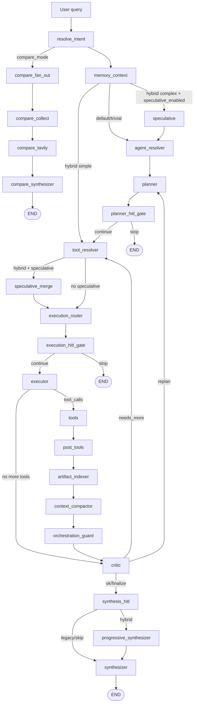
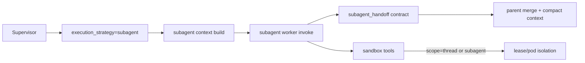

# OneSeek Platform

OneSeek ar en agentplattform for realtidsanalys, verktygsorkestrering och transparent AI-beslutslogik.
Projektet har historiskt hetat SurfSense, vilket fortfarande syns i vissa katalognamn (`surfsense_backend`, `surfsense_web`), men arkitekturen nedan beskriver den aktuella OneSeek-implementationen.

---

## Innehallsforteckning

1. [Plattformsoversikt](#plattformsoversikt)
2. [Karnfunktioner](#karnfunktioner)
3. [LangGraph-flode (Fas 1-4 + subagent A-F)](#langgraph-flode-fas-1-4--subagent-a-f)
4. [Strict subagent isolation + DeerFlow-style context (A-F)](#strict-subagent-isolation--deerflow-style-context-a-f)
5. [Intent + Bigtool + Namespace + Rerank](#intent--bigtool--namespace--rerank)
6. [Realtidsdata och API-integrationer](#realtidsdata-och-api-integrationer)
7. [Compare-lage](#compare-lage)
8. [LangSmith + full transparens (trace)](#langsmith--full-transparens-trace)
9. [Memory och feedback-loopar](#memory-och-feedback-loopar)
10. [Eval-systemet](#eval-systemet)
11. [SSE/Data Stream-events](#ssedata-stream-events)
12. [Kodstruktur (viktigaste filer)](#kodstruktur-viktigaste-filer)
13. [Konfiguration och feature flags](#konfiguration-och-feature-flags)
14. [Sandbox step-by-step guide](#sandbox-step-by-step-guide)
15. [Copy-paste only quickstart (Docker + K8s)](#copy-paste-only-quickstart-docker--k8s)
16. [Teststatus for Fas 1-4 + eval](#teststatus-for-fas-1-4--eval)

---

## Plattformsoversikt

OneSeek ar byggt for att:

- routa fragor till ratt agent och verktyg
- hamta data fran interna och externa kallor i realtid
- kombinera deterministisk kontroll med LLM-baserad syntes
- exponera hela kedjan (fraga -> route -> plan -> verktyg -> svar) via trace
- evaluera och iterera systematiskt med inbyggt eval-system

Tekniskt anvands:

- **FastAPI** (backend/API)
- **LangGraph** (agentgraf och tillstand)
- **Bigtool-retrieval** (dynamiskt verktygsval)
- **LiteLLM** (modellabstraktion)
- **PostgreSQL + Redis + Celery** (persistens och asynkjobb)
- **Vercel AI Data Stream-protokoll (SSE)** for realtidsstreaming i UI

---

## Karnfunktioner

- **Hybrid Supervisor v2 (Fas 1-4)**
  - graph complexity-klassning (`trivial`, `simple`, `complex`)
  - execution strategy-router (`inline`, `parallel`, `subagent`)
  - speculative branch + merge
  - progressive synthesizer med draft-streaming
  - strict subagent isolation + DeerFlow-style context management (A-F)
- **Deterministiskt compare-lage**
  - parallella externa modellanrop
  - separat compare-subgraf
- **Realtids-APIer**
  - trafik, vader, statistik, riksdag, bolag, geodata, marknadsplatser m.m.
- **Transparens och observability**
  - in-app trace spans (input/output/meta/tokens/duration)
  - LangSmith-stod via env-konfiguration
- **Eval och auto-loop**
  - route/agent/tool/API-input-eval
  - metadata/prompt/tuning-forslag
  - stage-jamforelse over tid

---

## LangGraph-flode (Fas 1-4 + subagent A-F)

### Huvudflode (normal mode)



### Nodlogik som tillkommit i Fas 1-4 + A-F

- **Fas 1**
  - `resolve_intent`: klassar `graph_complexity`
  - `smart_critic`: mekaniska regler + fallback till LLM-critic
  - `targeted_missing_info` till `tool_resolver`
- **Fas 2**
  - `execution_router`: val av `inline/parallel/subagent`
  - timeout-policy per strategi
- **Fas 3**
  - episodic memory (TTL + LRU, scope per `search_space_id` + `user_id`)
  - retrieval feedback-store som paverkar ranking
- **Fas 4**
  - `speculative` + `speculative_merge`
  - ateranvandning av speculative resultat i `call_agent` och `call_agents_parallel`
  - `progressive_synthesizer` + `data-synthesis-draft` i stream
- **Fas D**
  - `artifact_indexer`: offload av stora payloads till artifacts
  - `artifact_manifest` injiceras i prompt som kompakta refs
- **Fas E**
  - `context_compactor`: bygger `rolling_context_summary` nar contextbudget blir hog
  - pruning anvander semantisk sammanfattning i stallet for generisk marker
- **Fas F**
  - `memory_context`: selektiv cross-session memory-injektion fran `user_memories`
  - tydlig separering mellan aktiv session-kontekst och persistent minneskontekst

---

## Strict subagent isolation + DeerFlow-style context (A-F)

OneSeek har nu ett strict isolation-spor som kan slas pa med runtime-flaggor.

### Fas A - context isolation + handoff contracts

- subagent-korningar far eget `subagent_id`
- subagent worker invoke far egen checkpoint namespace
- parent far kompakta handoff-kontrakt (`summary/findings/artifact_refs`)

### Fas B - sandbox scope isolation

- sandbox leases kan scopeas per `thread` eller per `subagent`
- strict mode injicerar `sandbox_scope=subagent` + `sandbox_scope_id=<subagent_id>`
- olika subagents i samma thread kan fa separata leases/pods

### Fas C - context management + observability

- parent prompt fylls med kompakta `subagent_handoffs` i stallet for full historik
- subagent parallelism kan begransas med `subagent_max_concurrency`
- route/runtime metadata exponerar subagent-flaggor i trace



### DeerFlow-style context management (D/E/F)

OneSeek innehaller nu en context-pipeline inspirerad av DeerFlow:

- **Fas D - Artifact-first offload**
  - stora tool-payloads offloadas automatiskt till artifact-filer
  - supervisor sparar endast kompakt metadata i `artifact_manifest`
  - prompten far `<artifact_manifest>` med refs i stallet for full raw payload

- **Fas E - Semantic compaction**
  - `context_compactor` bygger `rolling_context_summary` nar context blir stor
  - gamla steg komprimeras till semantisk sammanfattning
  - message-pruning anvander sammanfattningen i stallet for en generisk markor

- **Fas F - Session vs cross-session memory**
  - cross-session minne hamtas selektivt fran `user_memories`
  - endast relevanta minnesposter injiceras via `<cross_session_memory>`
  - aktiv session-kontekst (plan, handoffs, artifacts) hanteras separat

Nya runtime-flaggor:

- `artifact_offload_enabled` (bool)
- `artifact_offload_threshold_chars` (int)
- `artifact_offload_max_entries` (int)
- `context_compaction_enabled` (bool)
- `context_compaction_trigger_ratio` (float 0-1)
- `context_compaction_summary_max_chars` (int)
- `cross_session_memory_enabled` (bool)
- `cross_session_memory_max_items` (int)
- `cross_session_memory_max_chars` (int)

---

## Intent + Bigtool + Namespace + Rerank

### Intent och agentval

1. Top-level route dispatch (`knowledge`, `action`, `statistics`, `smalltalk`, `compare`)
2. Intent resolver bygger `intent_id`, confidence, reason
3. Supervisor valjer agent(er) dynamiskt (`retrieve_agents`)

### Bigtool namespace-struktur

Verktyg indexeras i namespace-hierarki, t.ex.:

- `tools/knowledge/*`
- `tools/action/*`
- `tools/statistics/*`
- `tools/general/*`
- `tools/compare/*`
- doman-specifika som `tools/marketplace/*`, `tools/politik/*`

### Retrieval + scoring + rerank

Smart retrieval beraknar flera komponenter:

- namnmatch
- keyword-traf
- beskrivningstraf
- example-query-traf
- embedding-likhet
- namespace-boost
- retrieval-feedback-boost

Pre-score:

```text
pre_rerank_score =
  lexical_score
  + (embedding_score * embedding_weight)
  + namespace_bonus
  + retrieval_feedback_boost
```

Sedan rerankas kandidater med `RerankerService` och exponerar detaljer i breakdown/trace.

---

## Realtidsdata och API-integrationer

OneSeek har verktyg for live data och officiella kallor, bl.a.:

- **SMHI** (vader)
- **Trafiklab** (rutter/avgangar)
- **Trafikverket** (trafik, kameror, vagstatus m.m.)
- **SCB** (statistik)
- **Riksdagen** (dokument, voteringar, anforanden)
- **Bolagsverket** (bolagsdata)
- **Geoapify** (kartor/geokodning)
- **Marketplace** (Blocket/Tradera-relaterade floden)
- **Web/knowledge** (t.ex. Tavily, docs, intern kunskapsbas)

Tool-output kan ingestas till connector-lagret for citationer och historik.

---

## Compare-lage

Compare ar en deterministisk subgraf (inte "fri" LLM-tool-calling):

1. `compare_fan_out`: anropar **alla** externa compare-modeller parallellt
2. `compare_collect`: sammanstaller status/komplettering
3. `compare_tavily`: optional web-enrichment
4. `compare_synthesizer`: slutlig syntes

Vanliga compare-modeller (via externa toolspecs) inkluderar:

- Grok
- GPT
- Claude
- Gemini
- DeepSeek
- Perplexity
- Qwen

Designmal:

- inga oavsiktliga modellbortfall
- full verktygshistorik till frontend
- konsekvent citerings- och outputflode

---

## LangSmith + full transparens (trace)

### LangSmith (ibland kallat "Longsmith")

Projektet har LangSmith-observability via env:

```env
LANGSMITH_TRACING=true
LANGSMITH_ENDPOINT=https://api.smith.langchain.com
LANGSMITH_API_KEY=...
LANGSMITH_PROJECT=surfsense
```

### In-app trace (full kedja i plattformen)

Ut over extern observability har OneSeek en intern trace-pipeline:

- `ChatTraceSession` + `ChatTraceSpan` i DB
- spans for chain/model/tool med:
  - input (inklusive prompt payload for model-span)
  - output
  - meta
  - input/output/total tokens
  - duration/status/parent-child

SSE-events:

- `data-trace-session`
- `data-trace-span`

API-endpoints:

- `GET /threads/{thread_id}/messages/{message_id}/traces`
- `POST /threads/{thread_id}/trace-sessions/{trace_session_id}/attach`

Detta ger praktisk "fran fraga till svar"-transparens, inklusive verktygsinput/verktygsoutput och interna nodsteg.

---

## Memory och feedback-loopar

### Episodic memory (Fas 3)

- processminne med TTL + LRU
- keying/scoping per `search_space_id` + `user_id`
- anvands for att undvika onodiga omanrop av samma query/tool

### Retrieval feedback (Fas 3)

- success/failure-signal per query/tool
- score -> boost/penalty i retrievalrankingen
- stanger loopen mellan utfall och framtida verktygsval

### Speculative reuse (Fas 4)

- speculative path forbereder sannolika verktyg
- `speculative_merge` markerar vad som kan ateranvandas
- `call_agent` / `call_agents_parallel` hoppar over duplicerade anrop vid hit

---

## Eval-systemet

OneSeek har ett komplett evalsystem for supervised iteration.

### Stage-typer

- **Tool selection eval**
- **API input eval**
- **Auto-loop eval** (iterativ tuning)

### Viktiga endpoints

- `POST /tool-settings/evaluate`
- `POST /tool-settings/evaluate/start`
- `GET /tool-settings/evaluate/{job_id}`
- `POST /tool-settings/evaluate-api-input`
- `POST /tool-settings/evaluate-api-input/start`
- `GET /tool-settings/evaluate-api-input/{job_id}`
- `POST /tool-settings/evaluate-auto-loop/start`

### Metriker (inkl. Fas 1-4)

- `intent_accuracy`
- `route_accuracy`
- `sub_route_accuracy`
- `graph_complexity_accuracy`
- `execution_strategy_accuracy`
- `agent_accuracy`
- `plan_accuracy`
- `tool_accuracy`
- `retrieval_recall_at_k`
- `supervisor_review_score` / `supervisor_review_pass_rate`
- API-input-specifika: schema validity, required field recall, field value accuracy, clarification accuracy

### Eval-output och forslag

Evalsystemet kan generera:

- metadata-forslag for tools
- prompt-forslag (agent/supervisor/tool)
- retrieval tuning-forslag
- intent-definition-forslag
- stage-jamforelse med trend/guidance

---

## SSE/Data Stream-events

Frontend far live-events via Vercel AI data stream. Exempel:

- `text-delta`
- `data-thinking-step`
- `data-context-stats`
- `data-trace-session`
- `data-trace-span`
- `data-synthesis-draft` (Fas 4)

`data-synthesis-draft` skickas innan slutsyntesen nar progressive synthesizer ar aktiv.

---

## Kodstruktur (viktigaste filer)

- `surfsense_backend/app/agents/new_chat/supervisor_agent.py`
- `surfsense_backend/app/agents/new_chat/nodes/intent.py`
- `surfsense_backend/app/agents/new_chat/nodes/execution_router.py`
- `surfsense_backend/app/agents/new_chat/nodes/smart_critic.py`
- `surfsense_backend/app/agents/new_chat/nodes/speculative.py`
- `surfsense_backend/app/agents/new_chat/nodes/progressive_synthesizer.py`
- `surfsense_backend/app/agents/new_chat/episodic_memory.py`
- `surfsense_backend/app/agents/new_chat/retrieval_feedback.py`
- `surfsense_backend/app/agents/new_chat/bigtool_store.py`
- `surfsense_backend/app/tasks/chat/stream_new_chat.py`
- `surfsense_backend/app/services/tool_evaluation_service.py`
- `surfsense_backend/app/routes/admin_tool_settings_routes.py`
- `surfsense_backend/app/services/trace_service.py`

---

## Konfiguration och feature flags

Runtime-flaggor i chatflodet:

```json
{
  "runtime_hitl": {
    "enabled": true,
    "hybrid_mode": true,
    "speculative_enabled": true,
    "subagent_enabled": true,
    "subagent_isolation_enabled": true,
    "subagent_max_concurrency": 3,
    "subagent_context_max_chars": 1400,
    "subagent_result_max_chars": 1000,
    "subagent_sandbox_scope": "subagent",
    "artifact_offload_enabled": true,
    "artifact_offload_threshold_chars": 4000,
    "artifact_offload_max_entries": 36,
    "context_compaction_enabled": true,
    "context_compaction_trigger_ratio": 0.65,
    "context_compaction_summary_max_chars": 1600,
    "cross_session_memory_enabled": true,
    "cross_session_memory_max_items": 6,
    "cross_session_memory_max_chars": 1000,
    "sandbox_enabled": true,
    "sandbox_mode": "provisioner",
    "sandbox_provisioner_url": "http://sandbox-provisioner.oneseek-sandbox.svc.cluster.local:8002",
    "sandbox_state_store": "redis",
    "sandbox_idle_timeout_seconds": 900,
    "sandbox_scope": "subagent"
  }
}
```

- `hybrid_mode=false`: legacy/kompatibilitetsflode
- `hybrid_mode=true`: aktiverar hybridnoder
- `speculative_enabled=true`: aktiverar speculative branch i komplexa queries
- `subagent_enabled=true`: tillater execution_strategy=subagent
- `subagent_isolation_enabled=true`: strict subagent context isolation + handoff contracts
- `subagent_max_concurrency=3`: begransar parallel subagent-korning per steg
- `subagent_context_max_chars`: max parent-context in i subagent prompt
- `subagent_result_max_chars`: max compact resultat tillbaka till parent
- `subagent_sandbox_scope=subagent`: rekommenderat for strict sandbox-isolering
- `artifact_offload_enabled=true`: flyttar stora tool-payloads till artifact-filer
- `artifact_offload_threshold_chars`: storleksgrans for offload
- `artifact_offload_max_entries`: max artifact-referenser i state
- `context_compaction_enabled=true`: aktiverar semantisk compaction-node
- `context_compaction_trigger_ratio`: token-budget ratio som triggar compaction
- `context_compaction_summary_max_chars`: max langd for rolling summary
- `cross_session_memory_enabled=true`: selektiv injektion av persistent minne
- `cross_session_memory_max_items`: max antal minnesposter per turn
- `cross_session_memory_max_chars`: max tecken for minnesblock i prompt
- `sandbox_enabled=true`: aktiverar sandbox-tools for code-agent
- `sandbox_mode=provisioner`: kor via extern sandbox-provisioner (Kubernetes)
- `sandbox_state_store=redis`: rekommenderat vid flera backend-replikor
- `sandbox_scope=subagent`: explicit scope policy (kan satts automatiskt i strict mode)

---

## Sandbox step-by-step guide

Full setup, installation, manifests, runtime settings, Docker + Kubernetes drift och manuella tester finns i:

- [`docs/sandbox-kubernetes-provisioner-guide.md`](docs/sandbox-kubernetes-provisioner-guide.md)

---

## Copy-paste only quickstart (Docker + K8s)

### A) Docker quickstart (minimal)

```bash
cd /workspace/surfsense_backend
python3 -m pytest -q tests/test_sandbox_phase1.py tests/test_sandbox_phase2_filesystem.py
```

Use this runtime payload:

```json
{
  "runtime_hitl": {
    "hybrid_mode": true,
    "speculative_enabled": true,
    "subagent_enabled": true,
    "subagent_isolation_enabled": true,
    "subagent_sandbox_scope": "subagent",
    "artifact_offload_enabled": true,
    "artifact_offload_threshold_chars": 4000,
    "context_compaction_enabled": true,
    "context_compaction_trigger_ratio": 0.65,
    "cross_session_memory_enabled": true,
    "cross_session_memory_max_items": 6,
    "sandbox_enabled": true,
    "sandbox_mode": "docker",
    "sandbox_docker_image": "python:3.12-slim",
    "sandbox_container_prefix": "oneseek-sandbox",
    "sandbox_state_store": "file",
    "sandbox_idle_timeout_seconds": 900
  }
}
```

Optional check:

```bash
docker ps --format "table {{.Names}}\t{{.Image}}\t{{.Status}}"
```

### B) Docker Desktop Kubernetes quickstart (minimal)

```bash
cd /workspace
kubectl config use-context docker-desktop
docker build -f surfsense_backend/docker/provisioner/Dockerfile -t oneseek-sandbox-provisioner:local surfsense_backend
kubectl apply -k surfsense_backend/deploy/k8s/sandbox-provisioner
kubectl -n oneseek-sandbox set image deployment/sandbox-provisioner sandbox-provisioner=oneseek-sandbox-provisioner:local
kubectl -n oneseek-sandbox rollout status deployment/sandbox-provisioner
kubectl -n oneseek-sandbox port-forward svc/sandbox-provisioner 8002:8002
```

In another terminal:

```bash
curl http://127.0.0.1:8002/healthz
```

Use this runtime payload:

```json
{
  "runtime_hitl": {
    "hybrid_mode": true,
    "speculative_enabled": true,
    "subagent_enabled": true,
    "subagent_isolation_enabled": true,
    "subagent_max_concurrency": 3,
    "subagent_context_max_chars": 1400,
    "subagent_result_max_chars": 1000,
    "subagent_sandbox_scope": "subagent",
    "artifact_offload_enabled": true,
    "artifact_offload_threshold_chars": 4000,
    "context_compaction_enabled": true,
    "context_compaction_trigger_ratio": 0.65,
    "cross_session_memory_enabled": true,
    "cross_session_memory_max_items": 6,
    "sandbox_enabled": true,
    "sandbox_mode": "provisioner",
    "sandbox_provisioner_url": "http://127.0.0.1:8002",
    "sandbox_state_store": "file",
    "sandbox_idle_timeout_seconds": 900
  }
}
```

---

## Teststatus for Fas 1-4 + eval

Karnsviter for hybrid och eval:

- `tests/test_hybrid_phase1.py`
- `tests/test_execution_router_phase2.py`
- `tests/test_phase3_memory_feedback.py`
- `tests/test_phase4_speculative_progressive.py`
- `tests/test_sandbox_phase1.py`
- `tests/test_sandbox_phase2_filesystem.py`
- `tests/test_sandbox_phase3_robustness.py`
- `tests/test_sandbox_phase3_provisioner.py`
- `tests/test_sandbox_phase3_trace_spans.py`
- `tests/test_tool_evaluation_service.py`

Exempelkommando:

```bash
cd surfsense_backend
python3 -m pytest -q \
  tests/test_tool_evaluation_service.py \
  tests/test_hybrid_phase1.py \
  tests/test_execution_router_phase2.py \
  tests/test_phase3_memory_feedback.py \
  tests/test_phase4_speculative_progressive.py \
  tests/test_sandbox_phase1.py \
  tests/test_sandbox_phase2_filesystem.py \
  tests/test_sandbox_phase3_robustness.py \
  tests/test_sandbox_phase3_provisioner.py \
  tests/test_sandbox_phase3_trace_spans.py
```

---

## Sammanfattning

OneSeek ar nu en hybrid, transparent och eval-driven agentplattform med:

- adaptiv LangGraph-orkestrering (Fas 1-4)
- strict subagent isolation + DeerFlow-style context management (A-F)
- artifact-first offload + `artifact_manifest` for stora payloads
- semantisk context compaction med `rolling_context_summary`
- selektiv cross-session memory-injektion separerad fran aktiv session-kontekst
- dynamiskt agent- och verktygsval med Bigtool namespaces + rerank
- realtidsdata och compare-subgraf
- LangSmith + intern trace for full observability
- produktionsnara evalloop for kontinuerlig forbattring

