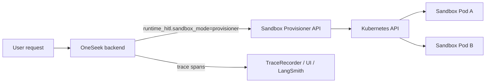

# OneSeek Sandbox Provisioner (Docker Desktop Kubernetes) - Complete Guide

This guide describes the full setup for running OneSeek sandbox execution with a DeerFlow-style Kubernetes provisioner on Docker Desktop Kubernetes.

It covers:

- architecture and flow
- backend/runtime settings
- provisioner service settings
- Kubernetes deployment
- manual validation for phase 3 and phase 4 goals
- troubleshooting and operations

---

## 1) Architecture overview



Execution model:

1. Backend selects sandbox tools (`sandbox_execute`, `sandbox_ls`, `sandbox_read_file`, `sandbox_write_file`, `sandbox_replace`, `sandbox_release`).
2. Backend acquires a sandbox lease (`acquire`) via provisioner.
3. Provisioner creates or reuses a pod per `thread/sandbox`.
4. Backend executes commands/file operations via provisioner endpoints.
5. Backend + provisioner perform idle cleanup and explicit release.

---

## 2) What is implemented now

### Backend (already integrated)

- `sandbox_mode=provisioner` (also accepts `remote` alias).
- Lease/state store with lock support:
  - `sandbox_state_store=file|redis|auto`
  - file lock via `fcntl`
  - redis lock when redis configured
- restart-safe reuse (same thread can reuse lease after backend restart)
- idle timeout cleanup (`sandbox_idle_timeout_seconds`)
- trace spans for:
  - `sandbox.acquire`
  - `sandbox.execute`
  - `sandbox.release`

### Provisioner service (new)

- FastAPI service at `app/sandbox_provisioner/main.py`
- Endpoints:
  - `POST /v1/sandbox/acquire`
  - `POST /v1/sandbox/release`
  - `POST /v1/sandbox/execute`
  - `POST /v1/sandbox/ls`
  - `POST /v1/sandbox/read_file`
  - `POST /v1/sandbox/write_file`
  - `POST /v1/sandbox/replace`
  - `POST /v1/sandbox/cleanup_idle`
  - `GET /healthz`
- Kubernetes Pod lifecycle via `kubectl`:
  - create/reuse sandbox pod
  - execute commands (`kubectl exec`)
  - cleanup idle pods

### Kubernetes manifests (new)

Folder:

`surfsense_backend/deploy/k8s/sandbox-provisioner`

Includes:

- `namespace.yaml`
- `rbac.yaml`
- `deployment.yaml`
- `service.yaml`
- `kustomization.yaml`

---

## 3) Prerequisites

1. Docker Desktop with Kubernetes enabled.
2. `kubectl` configured to Docker Desktop context.
3. OneSeek backend running (local or cluster).
4. Optional but recommended for multi-backend replicas: Redis.

Quick checks:

```bash
kubectl config use-context docker-desktop
kubectl get nodes
kubectl get ns
```

---

## 4) Build and run the provisioner image

Provisioner Dockerfile:

`surfsense_backend/docker/provisioner/Dockerfile`

Build image:

```bash
docker build \
  -f surfsense_backend/docker/provisioner/Dockerfile \
  -t oneseek-sandbox-provisioner:local \
  surfsense_backend
```

For Docker Desktop Kubernetes, local images are typically available directly in the cluster.

---

## 5) Deploy provisioner to Kubernetes

Apply manifests:

```bash
kubectl apply -k surfsense_backend/deploy/k8s/sandbox-provisioner
```

Set deployment image:

```bash
kubectl -n oneseek-sandbox set image \
  deployment/sandbox-provisioner \
  sandbox-provisioner=oneseek-sandbox-provisioner:local
```

Verify:

```bash
kubectl -n oneseek-sandbox get pods -o wide
kubectl -n oneseek-sandbox get svc sandbox-provisioner
kubectl -n oneseek-sandbox logs deployment/sandbox-provisioner --tail=100
```

Optional local access from host:

```bash
kubectl -n oneseek-sandbox port-forward svc/sandbox-provisioner 8002:8002
curl http://127.0.0.1:8002/healthz
```

---

## 6) Backend configuration (runtime flags)

Set these in `runtime_hitl` for a chat/session:

```json
{
  "runtime_hitl": {
    "sandbox_enabled": true,
    "sandbox_mode": "provisioner",
    "sandbox_provisioner_url": "http://127.0.0.1:8002",
    "sandbox_provisioner_api_key": "",
    "sandbox_state_store": "redis",
    "sandbox_state_redis_url": "redis://localhost:6379/0",
    "sandbox_idle_timeout_seconds": 900
  }
}
```

### Important flags

| Flag | Type | Recommended | Description |
|---|---|---|---|
| `sandbox_enabled` | bool | `true` | Enables sandbox tools |
| `sandbox_mode` | str | `provisioner` | `local`, `docker`, or `provisioner` |
| `sandbox_provisioner_url` | str | set | Base URL for provisioner service |
| `sandbox_provisioner_api_key` | str | optional | Bearer auth from backend to provisioner |
| `sandbox_state_store` | str | `redis` in multi-replica | `file`, `redis`, `auto` |
| `sandbox_state_redis_url` | str | set for redis | Shared lease/state coordination |
| `sandbox_idle_timeout_seconds` | int | `900` | Idle timeout for lease cleanup |
| `sandbox_timeout_seconds` | int | `30` | Command timeout default |
| `sandbox_max_output_bytes` | int | `100000` | Output cap per command |

### Multi-replica backend note

If backend runs with multiple replicas, use:

- `sandbox_state_store=redis`
- shared `sandbox_state_redis_url`

This avoids lease collisions when requests for the same thread hit different backend pods.

---

## 7) Provisioner environment settings

Environment variables for provisioner deployment:

| Variable | Default | Description |
|---|---|---|
| `PROVISIONER_NAMESPACE` | `oneseek-sandbox` | Namespace for worker pods |
| `PROVISIONER_KUBECTL_BINARY` | `kubectl` | Kubectl executable |
| `PROVISIONER_KUBECTL_CONTEXT` | empty | Optional context override |
| `PROVISIONER_SANDBOX_IMAGE` | `python:3.12-slim` | Image used for sandbox worker pods |
| `PROVISIONER_WORKER_CONTAINER_NAME` | `sandbox` | Container name in worker pod |
| `PROVISIONER_POD_PREFIX` | `oneseek-sb` | Prefix for pod names |
| `PROVISIONER_WORKSPACE_DIR` | `/workspace` | Working directory in pod |
| `PROVISIONER_STARTUP_TIMEOUT_SECONDS` | `120` | Wait timeout for pod ready |
| `PROVISIONER_IDLE_TIMEOUT_SECONDS` | `900` | Idle timeout before cleanup |
| `PROVISIONER_CLEANUP_INTERVAL_SECONDS` | `60` | Background cleanup loop interval |
| `PROVISIONER_MAX_TIMEOUT_SECONDS` | `600` | Max allowed command timeout |
| `PROVISIONER_MAX_OUTPUT_BYTES` | `1000000` | Max output size from exec |
| `PROVISIONER_API_KEY` | empty | Optional Bearer API key |
| `PROVISIONER_POD_CPU_REQUEST` | empty | Optional worker CPU request |
| `PROVISIONER_POD_MEMORY_REQUEST` | empty | Optional worker memory request |
| `PROVISIONER_POD_CPU_LIMIT` | empty | Optional worker CPU limit |
| `PROVISIONER_POD_MEMORY_LIMIT` | empty | Optional worker memory limit |

---

## 8) Manual validation (phase 3 + phase 4)

### A) Restart-safe reuse (phase 3)

Goal: same thread reuses sandbox lease after backend restart.

1. Run with:
   - `sandbox_enabled=true`
   - `sandbox_mode=provisioner`
2. In one thread, trigger `sandbox_execute` (e.g. `python3 -c "print(42)"`).
3. Restart backend process/pod.
4. Trigger another sandbox command in the same thread.
5. Verify:
   - tool output reports `reused=true` (or same lease/pod metadata)
   - same sandbox pod remains in Kubernetes.

Check:

```bash
kubectl -n oneseek-sandbox get pods -l app=oneseek-sandbox-worker
```

### B) Idle timeout rotation (phase 3)

Goal: idle timeout leads to new sandbox creation.

1. Set short timeout for test: `sandbox_idle_timeout_seconds=30`.
2. Execute once in thread A.
3. Wait >30 seconds.
4. Execute again in thread A.
5. Verify:
   - old lease/pod released
   - new lease/pod created.

### C) Trace observability (phase 3)

Goal: acquire/execute/release visible in trace.

For sandbox operations, verify trace contains:

- `sandbox.acquire`
- `sandbox.execute`
- `sandbox.release` (idle cleanup or explicit release)

### D) Pod-per-thread isolation (phase 4)

Goal: parallel threads -> separate pods.

1. Start N chat threads in parallel.
2. Trigger sandbox operations in each thread.
3. Verify N worker pods created.

```bash
kubectl -n oneseek-sandbox get pods -l app=oneseek-sandbox-worker
```

### E) Scale backend replicas without collisions (phase 4)

Goal: multiple backend replicas still coordinate leases.

1. Scale backend deployment to >1 replica.
2. Ensure shared Redis and `sandbox_state_store=redis`.
3. Send repeated sandbox requests for same thread.
4. Verify stable reuse (no duplicate conflicting pods for same thread/sandbox).

### F) Pod cleanup after release/timeout (phase 4)

1. Trigger explicit `sandbox_release`.
2. Verify pod removal.
3. For timeout cleanup, wait beyond idle timeout or call:

```bash
curl -X POST http://127.0.0.1:8002/v1/sandbox/cleanup_idle
```

---

## 9) Security notes

- Keep `sandbox_mode=provisioner` behind explicit runtime flags.
- Use `PROVISIONER_API_KEY` + `sandbox_provisioner_api_key` in production.
- Restrict provisioner RBAC to namespace-scoped Role (already in manifests).
- Keep worker image minimal and unprivileged where possible.
- Keep command timeouts and output caps enforced.

---

## 10) Troubleshooting

### Provisioner returns kubectl not found

- Ensure `kubectl` exists in provisioner image/container.

### 401 from provisioner

- Backend `sandbox_provisioner_api_key` must match provisioner `PROVISIONER_API_KEY`.
- Header format is `Authorization: Bearer <key>`.

### Pod stuck Pending

- Check resources/events:

```bash
kubectl -n oneseek-sandbox describe pod <pod-name>
kubectl -n oneseek-sandbox get events --sort-by=.metadata.creationTimestamp
```

### Backend does not reuse across replicas

- Ensure `sandbox_state_store=redis` and same Redis URL on all backend replicas.

### File operation path errors

- Only absolute paths are accepted.
- Paths are constrained to `/workspace`.

---

## 11) Quick command reference

```bash
# Deploy provisioner stack
kubectl apply -k surfsense_backend/deploy/k8s/sandbox-provisioner

# See provisioner logs
kubectl -n oneseek-sandbox logs deployment/sandbox-provisioner -f

# See active worker pods
kubectl -n oneseek-sandbox get pods -l app=oneseek-sandbox-worker

# Port-forward service to local host
kubectl -n oneseek-sandbox port-forward svc/sandbox-provisioner 8002:8002
```

