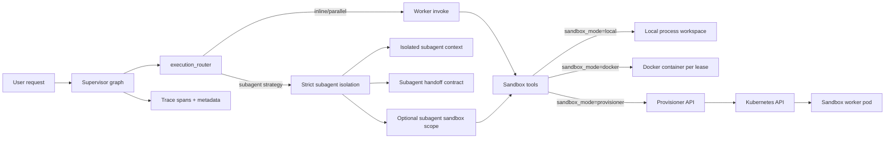

# OneSeek Sandbox: complete step-by-step guide (settings, Docker, Kubernetes)

This guide is the operational playbook for the full sandbox stack in OneSeek:

- local sandbox execution
- Docker sandbox execution
- Kubernetes provisioner execution
- strict subagent isolation (context + sandbox scope)
- runtime settings and validation tests

Use this when you want a single, practical document for setup and operations.

---

## 0. What this guide assumes

- Repo root: `/workspace`
- Backend code: `surfsense_backend`
- You are on a feature branch and can run `python3`, `docker`, `kubectl`
- Docker Desktop Kubernetes is enabled when running the K8s steps

---

## 1. Architecture and exact flow



### A/B/C delivery mapping

- **Phase A**: strict subagent context isolation + compact handoff contracts
- **Phase B**: strict subagent sandbox scope (`thread` vs `subagent`)
- **Phase C**: context management/observability wiring + rollout-ready docs/settings

---

## 2. Quick mode selection

Pick one mode first:

1. **local**: fastest for backend logic debugging (no container boundaries)
2. **docker**: local isolation with container boundary
3. **provisioner**: production-style backend -> provisioner -> Kubernetes pod

Recommended rollout:

1. Start with `sandbox_mode=local`
2. Move to `sandbox_mode=docker`
3. Move to `sandbox_mode=provisioner`
4. Enable strict subagent isolation flags

---

## 2.1 Copy-paste only minimal quickstart

### Docker (minimal)

```bash
cd /workspace/surfsense_backend
python3 -m pytest -q tests/test_sandbox_phase1.py tests/test_sandbox_phase2_filesystem.py
```

Runtime payload:

```json
{
  "runtime_hitl": {
    "hybrid_mode": true,
    "speculative_enabled": true,
    "subagent_enabled": true,
    "subagent_isolation_enabled": true,
    "subagent_sandbox_scope": "subagent",
    "sandbox_enabled": true,
    "sandbox_mode": "docker",
    "sandbox_docker_image": "python:3.12-slim",
    "sandbox_container_prefix": "oneseek-sandbox",
    "sandbox_state_store": "file",
    "sandbox_idle_timeout_seconds": 900
  }
}
```

Quick verify:

```bash
docker ps --format "table {{.Names}}\t{{.Image}}\t{{.Status}}"
```

### Docker Desktop Kubernetes (minimal)

```bash
cd /workspace
kubectl config use-context docker-desktop
docker build -f surfsense_backend/docker/provisioner/Dockerfile -t oneseek-sandbox-provisioner:local surfsense_backend
kubectl apply -k surfsense_backend/deploy/k8s/sandbox-provisioner
kubectl -n oneseek-sandbox set image deployment/sandbox-provisioner sandbox-provisioner=oneseek-sandbox-provisioner:local
kubectl -n oneseek-sandbox rollout status deployment/sandbox-provisioner
kubectl -n oneseek-sandbox port-forward svc/sandbox-provisioner 8002:8002
```

In another terminal:

```bash
curl http://127.0.0.1:8002/healthz
```

Runtime payload:

```json
{
  "runtime_hitl": {
    "hybrid_mode": true,
    "speculative_enabled": true,
    "subagent_enabled": true,
    "subagent_isolation_enabled": true,
    "subagent_max_concurrency": 3,
    "subagent_context_max_chars": 1400,
    "subagent_result_max_chars": 1000,
    "subagent_sandbox_scope": "subagent",
    "sandbox_enabled": true,
    "sandbox_mode": "provisioner",
    "sandbox_provisioner_url": "http://127.0.0.1:8002",
    "sandbox_state_store": "file",
    "sandbox_idle_timeout_seconds": 900
  }
}
```

---

## 3. Runtime settings (full flag reference)

All flags are passed in `runtime_hitl`.

### Core orchestration flags

| Flag | Type | Default | Purpose |
|---|---|---|---|
| `hybrid_mode` | bool | `false` | Enables hybrid supervisor flow |
| `speculative_enabled` | bool | `false` | Enables speculative branch |
| `subagent_enabled` | bool | `true` | Allows subagent execution strategy |
| `subagent_isolation_enabled` | bool | `false` | Enables strict subagent context isolation |
| `subagent_max_concurrency` | int | `3` | Parallel subagent cap per step |
| `subagent_context_max_chars` | int | `1400` | Max context chars injected into subagent |
| `subagent_result_max_chars` | int | `1000` | Max compacted subagent result chars |
| `subagent_sandbox_scope` | str | `thread` | Preferred sandbox scope policy for subagents |

### Sandbox flags

| Flag | Type | Default | Purpose |
|---|---|---|---|
| `sandbox_enabled` | bool | `false` | Enables sandbox tools |
| `sandbox_mode` | str | `docker` | `local`, `docker`, `provisioner` (or `remote`) |
| `sandbox_provisioner_url` | str | `http://localhost:8002` | Provisioner base URL |
| `sandbox_provisioner_api_key` | str | empty | Bearer auth for provisioner |
| `sandbox_state_store` | str | `file` | `file`, `redis`, `auto` |
| `sandbox_state_file_path` | str | auto | File-state path for lease store |
| `sandbox_state_redis_url` | str | empty | Redis lease store URL |
| `sandbox_state_redis_prefix` | str | `oneseek:sandbox` | Redis key prefix |
| `sandbox_idle_timeout_seconds` | int | `900` | Idle lease cleanup timeout |
| `sandbox_lock_timeout_seconds` | int | `15` | Lease lock timeout |
| `sandbox_timeout_seconds` | int | `30` | Command timeout |
| `sandbox_max_output_bytes` | int | `100000` | Command output cap |
| `sandbox_scope` | str | `thread` | Effective sandbox scope (`thread` or `subagent`) |
| `sandbox_scope_id` | str | empty | Scope id used when `sandbox_scope=subagent` |

Notes:

- `sandbox_scope` + `sandbox_scope_id` are used internally for strict subagent scope.
- In strict subagent mode, supervisor injects per-subagent `sandbox_scope_id` automatically.

---

## 4. Step-by-step: local mode (baseline)

### Step 4.1 - minimal runtime payload

```json
{
  "runtime_hitl": {
    "hybrid_mode": true,
    "speculative_enabled": true,
    "subagent_enabled": true,
    "subagent_isolation_enabled": true,
    "sandbox_enabled": true,
    "sandbox_mode": "local",
    "sandbox_state_store": "file",
    "sandbox_idle_timeout_seconds": 900
  }
}
```

### Step 4.2 - run validation tests

```bash
cd /workspace/surfsense_backend
python3 -m pytest -q \
  tests/test_sandbox_phase1.py \
  tests/test_sandbox_phase2_filesystem.py \
  tests/test_sandbox_phase3_robustness.py
```

### Step 4.3 - manual chat checks

Run a code-style prompt that triggers sandbox tools:

1. Ask for file creation in `/workspace`
2. Ask for read/update/replace
3. Confirm tool outputs include:
   - `mode`
   - `scope`
   - `scope_id` (when strict subagent scope is active)
   - `lease_id`

---

## 5. Step-by-step: Docker mode

### Step 5.1 - runtime payload

```json
{
  "runtime_hitl": {
    "hybrid_mode": true,
    "speculative_enabled": true,
    "subagent_enabled": true,
    "subagent_isolation_enabled": true,
    "sandbox_enabled": true,
    "sandbox_mode": "docker",
    "sandbox_docker_image": "python:3.12-slim",
    "sandbox_container_prefix": "oneseek-sandbox",
    "sandbox_state_store": "file"
  }
}
```

### Step 5.2 - verify containers

```bash
docker ps --format "table {{.Names}}\t{{.Image}}\t{{.Status}}"
```

Expected:

- one container per active lease/scope key
- same scope reuses lease/container
- different subagent scope ids create isolated leases

---

## 6. Step-by-step: Kubernetes provisioner mode

## 6.1 Prerequisites

```bash
kubectl config use-context docker-desktop
kubectl get nodes
```

## 6.2 Build provisioner image

```bash
cd /workspace
docker build \
  -f surfsense_backend/docker/provisioner/Dockerfile \
  -t oneseek-sandbox-provisioner:local \
  surfsense_backend
```

## 6.3 Deploy manifests

```bash
kubectl apply -k /workspace/surfsense_backend/deploy/k8s/sandbox-provisioner
kubectl -n oneseek-sandbox set image \
  deployment/sandbox-provisioner \
  sandbox-provisioner=oneseek-sandbox-provisioner:local
```

## 6.4 Verify provisioner health

```bash
kubectl -n oneseek-sandbox get pods
kubectl -n oneseek-sandbox get svc sandbox-provisioner
kubectl -n oneseek-sandbox logs deployment/sandbox-provisioner --tail=100
kubectl -n oneseek-sandbox port-forward svc/sandbox-provisioner 8002:8002
curl http://127.0.0.1:8002/healthz
```

## 6.5 Backend runtime payload for provisioner

```json
{
  "runtime_hitl": {
    "hybrid_mode": true,
    "speculative_enabled": true,
    "subagent_enabled": true,
    "subagent_isolation_enabled": true,
    "subagent_max_concurrency": 3,
    "subagent_context_max_chars": 1400,
    "subagent_result_max_chars": 1000,
    "subagent_sandbox_scope": "subagent",
    "sandbox_enabled": true,
    "sandbox_mode": "provisioner",
    "sandbox_provisioner_url": "http://sandbox-provisioner.oneseek-sandbox.svc.cluster.local:8002",
    "sandbox_provisioner_api_key": "",
    "sandbox_state_store": "redis",
    "sandbox_state_redis_url": "redis://redis.default.svc.cluster.local:6379/0",
    "sandbox_idle_timeout_seconds": 900
  }
}
```

---

## 7. Step-by-step validation matrix

Run these checks in order.

### Check A - strict context isolation

Goal: subagent output is compact handoff, not full sibling context.

Expected in supervisor/tool payload:

- `subagent_isolated=true`
- `subagent_id`
- `subagent_handoff.summary`
- `subagent_handoff.findings`

### Check B - strict sandbox scope isolation

Goal: different subagent scope ids do not share the same lease.

Expected:

- scope A and scope B have different `lease_id`
- scope A repeated call reuses the same `lease_id`

### Check C - provisioner pod isolation

Goal: different scope keys map to different pod identities.

```bash
kubectl -n oneseek-sandbox get pods -l app=oneseek-sandbox-worker
```

Expected:

- one pod per active sandbox id
- no collisions across concurrent thread/scope execution

### Check D - restart-safe lease reuse

Goal: same scope can be reused after backend restart.

Expected:

- `reused=true` on repeated call with same scope
- same pod/container identity when not idle-expired

### Check E - idle timeout cleanup

Set low timeout (example `30s`), wait past timeout, re-run command.

Expected:

- previous lease/pod released
- new lease_id/pod generated

---

## 8. Operations and cleanup

### Manual cleanup endpoint

```bash
curl -X POST http://127.0.0.1:8002/v1/sandbox/cleanup_idle
```

### Explicit release from tooling

Use `sandbox_release` tool to release current lease for active scope.

### Kubernetes cleanup

```bash
kubectl -n oneseek-sandbox delete pod -l app=oneseek-sandbox-worker
```

---

## 9. Troubleshooting

### 401 from provisioner

- Set matching values:
  - backend `sandbox_provisioner_api_key`
  - provisioner `PROVISIONER_API_KEY`
- Header must be `Authorization: Bearer <key>`

### Provisioner unreachable

- Check service/pods in namespace:

```bash
kubectl -n oneseek-sandbox get svc,pods
```

### Leases collide across backend replicas

- Use:
  - `sandbox_state_store=redis`
  - shared `sandbox_state_redis_url`

### Pod pending/stuck

```bash
kubectl -n oneseek-sandbox describe pod <pod-name>
kubectl -n oneseek-sandbox get events --sort-by=.metadata.creationTimestamp
```

### Path traversal errors

- Sandbox file APIs only accept absolute paths and enforce `/workspace` boundary.

---

## 10. Copy/paste command block

```bash
# 1) Build provisioner image
docker build -f surfsense_backend/docker/provisioner/Dockerfile -t oneseek-sandbox-provisioner:local surfsense_backend

# 2) Deploy K8s resources
kubectl apply -k surfsense_backend/deploy/k8s/sandbox-provisioner
kubectl -n oneseek-sandbox set image deployment/sandbox-provisioner sandbox-provisioner=oneseek-sandbox-provisioner:local

# 3) Health and logs
kubectl -n oneseek-sandbox get pods
kubectl -n oneseek-sandbox logs deployment/sandbox-provisioner --tail=100

# 4) Port-forward for local testing
kubectl -n oneseek-sandbox port-forward svc/sandbox-provisioner 8002:8002
curl http://127.0.0.1:8002/healthz
```

---

If you follow sections 4 -> 10 in order, you have a full end-to-end sandbox setup with strict subagent isolation, local and Docker validation, and Kubernetes provisioner production path.

