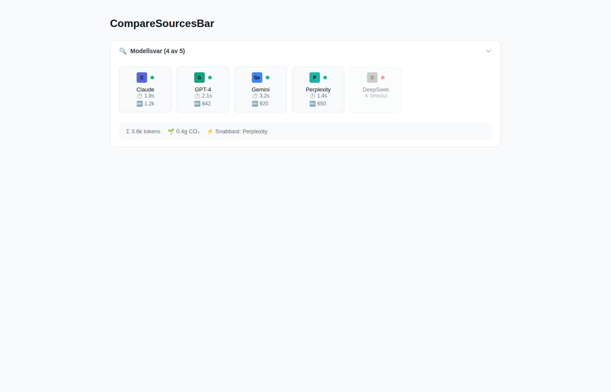
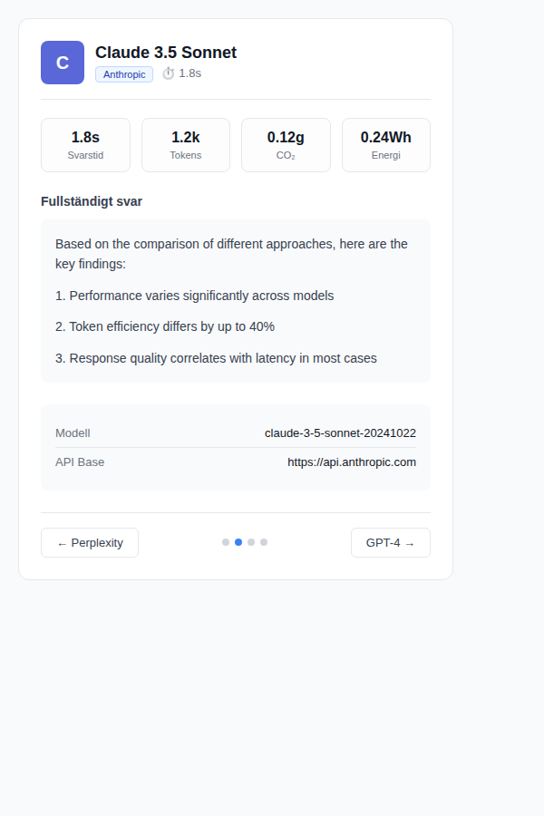
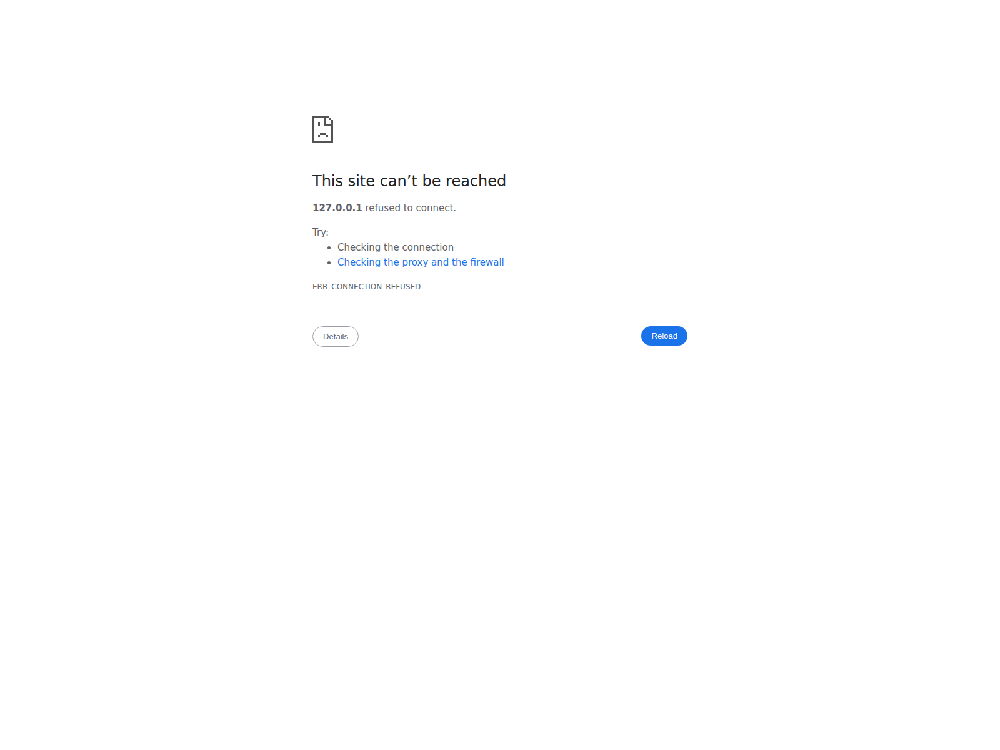

# Compare Mode Mockup Screenshots

This directory contains HTML files and screenshots that demonstrate the Progressive Disclosure Pattern for Compare Mode.

## Screenshots

### 1. CompareSourcesBar Component


The collapsible summary bar showing all provider responses with:
- Provider avatars with status indicators (green=success, red=error)
- Response time and token count for each provider
- Aggregate statistics (total tokens, CO₂, energy, fastest model)

### 2. CompareDetailSheet Component


The detailed view showing a single provider's full response:
- Provider header with logo and metadata
- 4-column stats grid (latency, tokens, CO₂, energy)
- Full markdown-rendered response
- Navigation controls (Previous/Next with dot indicators)

### 3. Full Mockup Layout


Complete chat interface showing both components in action with ThinkingSteps and synthesized answer.

## Interactive HTML Files

### Component Mockups (Light Mode)
- `screenshot-sources-bar-light.html` - CompareSourcesBar component with expanded provider avatars
- `screenshot-detail-sheet-light.html` - CompareDetailSheet component showing full provider details

### Complete Mockup
- `../compare-mode-mockup.html` - Full page mockup showing both light and dark modes with complete layout

## How to View

Open any HTML file in a web browser to see the component in action. All files use Tailwind CSS CDN for styling.

### Using a Local Server

```bash
# Navigate to the mockups directory
cd surfsense_web/public/mockups

# Start a simple HTTP server
python3 -m http.server 8000

# Open in browser
http://localhost:8000/compare-mode-mockup.html
```

## Components Demonstrated

### 1. CompareSourcesBar
- Collapsible header with "Modellsvar (X av Y)"
- Provider avatars with status indicators (green=success, red=error)
- Latency and token count for each provider
- Aggregate statistics footer
- Swedish language labels

### 2. CompareDetailSheet
- Responsive design (Sheet on desktop, Drawer on mobile)
- Provider header with logo and metadata
- 4-column stats grid (latency, tokens, CO₂, energy)
- Full markdown response
- Navigation with Previous/Next buttons
- Dot indicators for current position

## Design Features

- **Swedish UI**: All text in Swedish
- **Dark Mode**: Full support with semantic colors
- **Responsive**: Mobile (drawer) and desktop (sheet) layouts
- **Accessible**: Keyboard navigation, semantic HTML
- **Animations**: Smooth transitions and micro-interactions

## Implementation

See `COMPARE_MODE_IMPLEMENTATION.md` in the repository root for detailed architecture and integration documentation.
